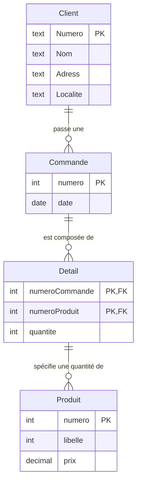
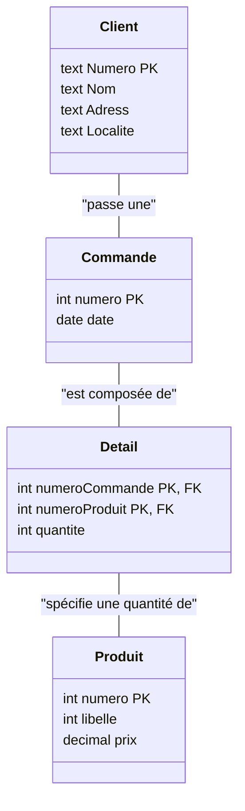

```mermaid
erDiagram

    Client {
        text Numero PK
        text Nom
        text Adress
        text Localite
    }

    Commande {
        int numero PK
        date date
    }

    Detail {
        int numeroCommande PK, FK
        int numeroProduit PK, FK
        int quantite
    }

    Produit {
        int numero PK
        int libelle
        decimal prix
    }

  Client ||--o{  Commande : "passe une"
  Commande ||--o{ Detail : "est composée de"
  Detail ||--o{ Produit : "spécifie une quantité de"

```

```mermaid
classDiagram

    class Client {
        text Numero PK
        text Nom
        text Adress
        text Localite
    }

    class Commande {
        int numero PK
        date date
    }

    class Detail {
        int numeroCommande PK, FK
        int numeroProduit PK, FK
        int quantite
    }

    class Produit {
        int numero PK
        int libelle
        decimal prix
    }

  Client --  Commande : "passe une"
  Commande -- Detail : "est composée de"
  Detail -- Produit : "spécifie une quantité de"


```