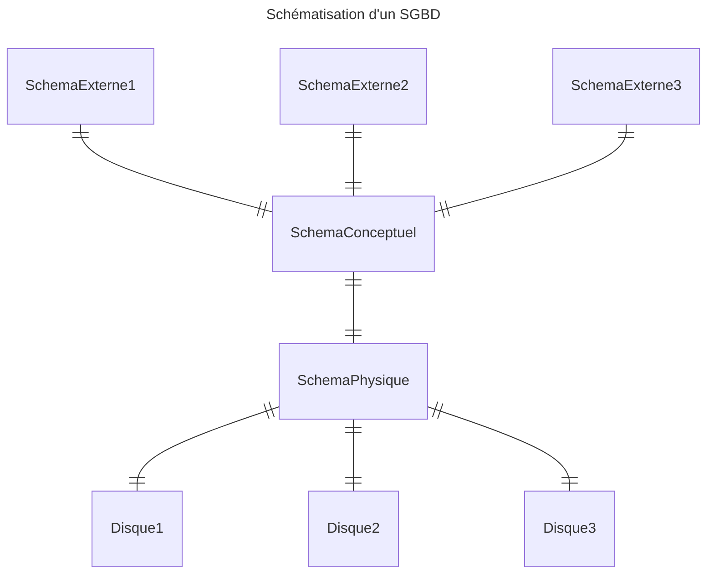

<!-- <iframe src="https://docs.google.com/presentation/d/e/2PACX-1vRAH6-YtNH7DKH6jk127wotWXtNwiCuG8v1Zs0jIhqQoqQOvyFnzcD-mvQeJd-Uiy8KyV6ZZpPbkweL/embed?start=false&loop=false&delayms=3000" frameborder="0" width="960" height="569" allowfullscreen="true" mozallowfullscreen="true" webkitallowfullscreen="true" style="min-height:488px"></iframe> -->

## Qu’est ce qu’une Base De Données (BDD) ?

- Une base de données est une **collection de données cohérentes** entre elles, généralement de taille importante
- Elle permet de modéliser des informations du monde réel grâce à :
  - Des **Entités**, e.g., étudiants, cours, notes, etc.
  - Des **Associations**, e.g., Bob a choisi le cours de BDD
- Exemples de bases de données :
  - Achats en ligne
  - Abonnement à un club de sport
  - Comptes en banque
  - Réservation de billets de train
  - Études à l’université
  - etc.
- Une **BDD informatique** doit être **interrogeable**

## Quels sont les défis des bases de données ?

- **Multilpicité** des types de données :
  - Données textuelles, multimédias (images, vidéo, musique), géographiques, dates, etc.
- L’**information incorrecte** et incomplète
  - Comment produire de l’information correcte à partir de données imprécises ou erronées ?
- Accès aisé par des non-informaticiens
- Maintenance et évolution
- Des **données distribuées** et nomades
  - Les données sont nomades, intermittentes, dupliquées
- Bases de données et le **Web**
- Les **données décisionnelles**
- Vers des normes d’accès aux données pour les applications
  - Par exemple : Hibernate, EJB, ORM, etc.

## Qu’est ce qu’un SGBD ?

- Un **Système de Gestion de Bases de Données (SGBD)** est un **logiciel** destiné au stockage et à la manipulation de bases de données
- Tous les traitements des données se font obligatoirement par son intermédiaire :
  - Interrogation
  - Ajout
  - Suppression
  - Modification
- Exemples de fournisseurs de SGBD-R (R pour relationnelles)
  - Oracle
  - MySQL
  - PostgreSQL
  - Etc.

## Pourquoi un SGBD ?

- Permettre l'indépendance entre les données et les applications
- Garantir la sûreté d’accès aux données entre le SGBD et les applications
- Réduire le temps de développement des applications
- Réduire des coûts de développement
- Garantir l'intégrité des données et sécuriser les accès
- Permettre une administration des données uniformes et cohérentes
- Permettre la concurrence des accès
- Permettre la reprise après les pannes

## Intégrité et unicité des données

- **Intégrité** :
  - les données contenues dans une BD forment un tout cohérent répondant à des contraintes d’intégrités vérifiées à tout moment par le SGBD
  - Exemples :
    - Tout électeur a un âge > 18 ans
    - A tout instant la somme des crédits = la somme des débits
- **Unicité** des données (non redondance)
  - Cohérence des données
    - Si une donnée est dupliquée, laquelle est la bonne ?
- Facilité de mise à jour et de recherche
  - Est-on sûr d’avoir mis à jour toutes les copies d’une même donnée ?

## Confidentialité et sûreté des traitements

- **Confidentialité**
  - Gestion des autorisations d’accès à tout ou partie de la BD aux différentes personnes de l’organisation
- **Concurrence**
  - Les données sont accédées simultanément par plusieurs utilisateurs
    - Éviter les conflits qui dégraderaient la cohérence de la BD
  - Chaque utilisateur à l’impression d’être le seul à travailler sur la BD
    - verrouillage, transaction
- **Sécurité**
  - Remise de la BD dans l’état cohérent le plus récent après une panne
  - Idée : Garder un journal ou log (historique) de toutes les actions élémentaires de mise à jour et de validation réalisées par le SGBD :
    - Avant qu’un changement ne soit réalisé, l’action est tracée dans un fichier de log
    - Après un crash, l’effet des transactions non abouties est annulé à l’aide du fichier de log

## Indépendance des données

- Indépendance des applications par rapport au modèle physique autorise :
  - de modifier l’organisation physique sans modifier le schéma logique ni les applications
    - d’ajout d’index
    - de changer de méthode d’accès, e.g., chaînage vs. hachage
- Indépendance logique des données
  - Chaque application ou groupe d’utilisateurs peut :
    - assembler différemment les données
    - ne voir qu’une partie des données (Schémas externes)
  - Permet de modifier le schéma logique sans modifier les applications
    - Ajout/suppression d’une entité

## Description des données

### Explication du schéma

- **Schémas externes** aussi appelé **vue**
  - Structure des données telle que perçue par chaque groupe de travail de l’organisation
  - tous les utilisateurs n’ont pas à connaître le schéma logique dans son ensemble
    - données inutiles à l’utilisateur
    - sécurité, confidentialité
- **Schéma conceptuel** aussi appelé schéma logique
  - Structure et sémantique des données d’une organisation sans souci d’implémentation.
  - Par exemple:
    - Type de données élémentaires des attributs des objets
    - Règles régissant les données
- **Schéma interne**
  - Structure de stockage des données en machine
    - fichiers (nom, organisation, localisation)
    - article des fichiers (longueur, champs, placement)
    - chemin d’accès aux données (index, chaînage, hachage)

### À travers des exemples

- Schéma externe
  - Cumul_mensuel (mois : string, idc :string, Nom : String, Prénom : string, total crédits :integer, total débits : integer)
- Schéma conceptuel
  - Clients (idl : integer, Nom : string, Prénom : string, Profession : string)
  - Comptes (idc : string, type : string, solde : string, idl : integer)
  - Opérations (idc : string, dte : date, type : string, montant : integer)
- Schéma interne
  - Les relations sont stockées dans des fichiers sur la machine

## Modèle de description de données

* **Modèle Conceptuel des Données (MCD)**
    * Ensemble de **concepts** et de **règles** de composition de ces concepts permettant de décrire des données
    * Exemples :
        * Modèle hiérarchique
        * Modèle réseau
        * Modèle relationnel
        * Modèle objets
* **Modèle Logique des Données (MLD)**
    * Langage de description de données (LDD)
    * Langage supportant un modèle et permettant de décrire les données d’une BD d’une manière assimilable par une machine
    * Exemples :
        * SQL (modèle relationnel)
