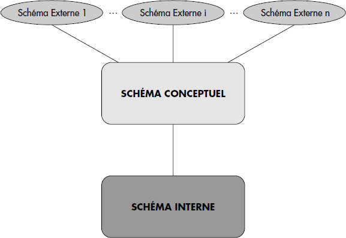

import Slide from '/src/components/Slide.astro';

<Slide>

## Qu'est-ce qu'une Base De Données (BDD) ?

> Même si vous n'avez jamais utilisé de système de gestion de bases de données (SGBD), vous avez probablement déjà une idée de ce qu'est une base de données 

</Slide>
<Slide title="Qu'est-ce qu'une Base De Données (BDD) ?">

- Une bdd est une **collection de données cohérentes** entre elles, généralement de taille importante
- Elle permet de **modéliser des informations** du monde réel grâce à :
  - Des **Entités**. Par exemple : étudiants, cours, notes, etc.
  - Des **Associations**. Par exemple : Bob a choisi le cours de BDD
- **Exemples de bdd** : Achats en ligne, Abonnement à un club de sport, Comptes en banque, Réservation de billets de train, Études à l'université, etc

</Slide>
<Slide>

:::note[À retenir]
Une base de données **informatique** doit être **interrogeable**
:::

</Slide>

## Quels sont les défis des bases de données ?

<Slide title="Quels sont les défis des bases de données ?">
- Gérer la **Multiplicité** des types de données :
  - Données textuelles, multimédias (images, vidéo, musique), géographiques, dates, etc.
- L'**information incorrecte** et incomplète
  - Comment produire de l'information correcte à partir de données imprécises ou erronées ?
- Permettre un accès aisé par des non-informaticiens
- Permettre la maintenance et l'évolution sans perte de données

</Slide>
<Slide title="Quels sont les défis des bases de données ?">
- Gérer des **données distribuées** et nomades
  - Les données sont nomades, intermittentes, dupliquées
- Gérer les bases de données sur le **Web**
- Permettre d'extraire des **données décisionnelles** (qui permettent d'aider aux décisions d'une entreprise)
- Offrir une norme d'accès aux données pour les applications (Programmes informatiques pour interagir avec les bases de données, souvent appelés ORM)

</Slide>
<Slide>

## Qu'est-ce qu'un **SG**BD ?

- Un **Système de Gestion de Bases de Données (SGBD)** est un **logiciel** destiné au stockage et à la manipulation de bases de données
- Tous les traitements des données se font obligatoirement par son intermédiaire : Interrogation, Ajout, Suppression, Modification
- Exemples de fournisseurs de SGBD-R (R pour relationnelles) : Oracle, MySQL, PostgreSQL, SQLite, SQL Server, etc

</Slide>
<Slide>

## Pourquoi a-t-on développé les SGBD ?

- Permettre l'**indépendance** entre les données et les applications
- Garantir la **sûreté** d'accès aux données entre le SGBD et les applications
- Réduire le **temps de développement** des applications
- Réduire les **coûts de développement**
- Garantir l'**intégrité** des données et sécuriser les accès
- Permettre une **administration** des données uniformes et cohérentes
- Permettre la **concurrence** des accès
- Permettre la **reprise** après les pannes

</Slide>
<Slide>

## Notions à connaître sur les BDD

</Slide>
<Slide title="Notions à connaître sur les BDD">

### Intégrité des données

- **Intégrité** : les données contenues dans une BD forment un tout cohérent répondant à des contraintes d'intégrités vérifiées à tout moment par le SGBD
- Exemples :
  - Tout électeur a un âge > 18 ans
  - A tout instant la somme des crédits = la somme des débits

</Slide>
<Slide title="Notions à connaître sur les BDD">

### Unicité des données

- **Unicité** des données (non-redondance) : Cohérence des données
  - Si une donnée est dupliquée, laquelle est la bonne ?
- **Facilité** de mise à jour et de recherche
  - Est-on sûr d'avoir mis à jour toutes les copies d'une même donnée ?

</Slide>
<Slide title="Notions à connaître sur les BDD">

### Confidentialité

- **Confidentialité** : Gestion des autorisations d'accès à tout ou partie de la BD aux différentes personnes de l'organisation
- **Concurrence** : Les données sont accédées simultanément par plusieurs utilisateurs
    - Éviter les conflits qui dégraderaient la cohérence de la BD
    - Chaque utilisateur à l'impression d'être le seul à travailler sur la BD : verrouillage, transaction, etc.

</Slide>
<Slide title="Notions à connaître sur les BDD">

### Sûreté des traitements

- **Sécurité** : Remise de la BD dans l'état cohérent le plus récent après une panne
- Idée : Garder un journal ou log (historique) de toutes les actions élémentaires de mise à jour et de validation réalisées par le SGBD :
  - Avant qu'un changement ne soit réalisé, l'action est tracée dans un fichier de log
  - Après un crash, l'effet des transactions non abouties est annulé à l'aide du fichier de log

</Slide>
<Slide title="Notions à connaître sur les BDD">

### Indépendance des données

- L'**indépendance des applications** par rapport au modèle physique autorise de modifier l'organisation physique sans modifier le schéma logique ni les applications
- **Indépendance logique** des données
  - Chaque application ou groupe d'utilisateurs peut :
    - assembler différemment les données
    - ne voir qu'une partie des données (Schémas externes)
  - Permet de modifier le schéma logique sans modifier les applications
    - Ajout/suppression d'une entité

</Slide>
<Slide>

### Description des données

</Slide>
<Slide title="Description des données">

#### Schémas

On parle de différents types de schémas pour décrire les différentes parties des SGBD.

Pour une base de données particulière, il existe **un seul schéma interne** et **un seul schéma conceptuel**. 

En revanche, il existe en général **plusieurs schémas externes** :

 
 

</Slide>

#### Les 3 types de schéma sont :

<Slide title="Les 3 types de schéma des bases de données sont :">

##### Le **Schéma interne**
Structure de stockage des données en machine
- fichiers (nom, organisation, localisation)
- article des fichiers (longueur, champs, placement)
- chemin d'accès aux données (index, chaînage, hachage)

</Slide>

<Slide title="Les 3 types de schéma des bases de données sont :">

##### Le **Schéma conceptuel** aussi appelé schéma logique
Structure et sémantique des données d'une organisation sans soucis d'implémentation.
Par exemple :
- Type de données élémentaires des attributs des objets
- Règles régissant les données

</Slide>

<Slide title="Les 3 types de schéma des bases de données sont :">

##### Les **Schémas externes** aussi appelés **vues**
Structure des données telle que perçue par chaque groupe de travail de l'organisation
Tous les utilisateurs n'ont pas à connaître le schéma logique dans son ensemble
- données inutiles à l'utilisateur
- sécurité, confidentialité

</Slide>

<Slide>

#### Les schémas à travers des exemples
  
##### Schéma conceptuel

Une base de données bancaire peut être décrite par les relations suivantes :

- **Clients** (idl : integer, Nom : string, Prénom : string, Profession : string)
- **Comptes** (idc : string, type : string, solde : string, idl : integer)
- **Opérations** (idc : string, dte : date, type : string, montant : integer)

##### Schéma interne

Les relations sont physiquement stockées dans des fichiers sur la machine qui héberge la base de données.

##### Schéma externe

Par exemple, un client peut voir les données suivantes :

- **Cumul_mensuel** (mois : string, idc :string, Nom : String, Prénom : string, totalCredits :integer, totalDebits : integer)

C'est une relation _temporaire_ qui n'existe pas dans la base de données, mais qui est créée à la demande par le SGBD.

</Slide>
<Slide>

### Modèles de description de données

Lors de la conception d'une base de données, les schémas précédemment évoqués sont définis à travers 2 modèles distincts :

##### Le **Modèle Conceptuel des Données (MCD)**
  * Ensemble de **concepts** et de **règles** de composition de ces concepts permettant de décrire des données
  * Exemples : Modèle hiérarchique, réseau, relationnel, objet, nosql, etc.
  * Présente les **concepts** des schémas

##### Le **Modèle Logique des Données (MLD)**
  * Langage de description de données (LDD), d'une manière assimilable par une machine
  * Exemples : SQL (modèle relationnel), Javascript (NoSQL), etc.
  * Présente l'implémentation des schémas pour la machine

</Slide>
<Slide>

:::note
En conception, les **MCD** et **MLD** sont utilisés pour définir les BDD.  
Les **MCT** (Modèle Conceptuel des Traitements) et **MLT** (Modèle Logique des Traitements) sont utilisées pour définir les applications (logiciels)
:::

</Slide>
<Slide>

### Conclusion

- Les bases de données sont des collections de données cohérentes entre elles
- Les SGBD sont des logiciels permettant de stocker et manipuler des bases de données
- Les SGBD ont été développés pour garantir l'intégrité, l'unicité, la confidentialité, la sûreté des traitements, l'indépendance des données
- Les bases de données sont décrites par des schémas interne, conceptuel et externe
- Les schémas sont définis à travers des modèles conceptuels et logiques

</Slide>
