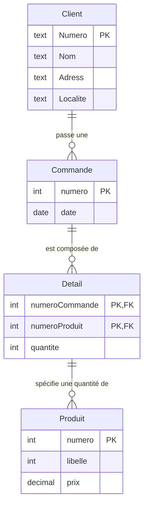

### Schémas

Les bases de données sont représentées sous formes textuelles, de schémas conceptuels, et de schémas logiques.
Ces représentations n'incluent pas les données : 
> schéma d'une base ≠ instance d'une base

#### Représentation textuelle

**Clients** (Numero, Nom, Adresse, Localite)
**Commandes** (Numero, Date, NumeroClient*)
**Produits** (Numero, Libelle, Prix)
**Details** (NumeroCommande*, NumeroProduit*, Quantité)

#### Schéma conceptuel (Diagramme Entités-Associations)

(Digrammes EA ou Entity-Relationship (ER) en anglais)

Les entités sont :

- Client
- Produit
- Commande
- Détail

Les associations sont :

- Un Client passe une Commande
- La Commande est comosée de Detail
- Les Detail spécifient des quantités de Produit

En schéma **Entité-Association**, ce bon de commande serait représenté de la sorte :

