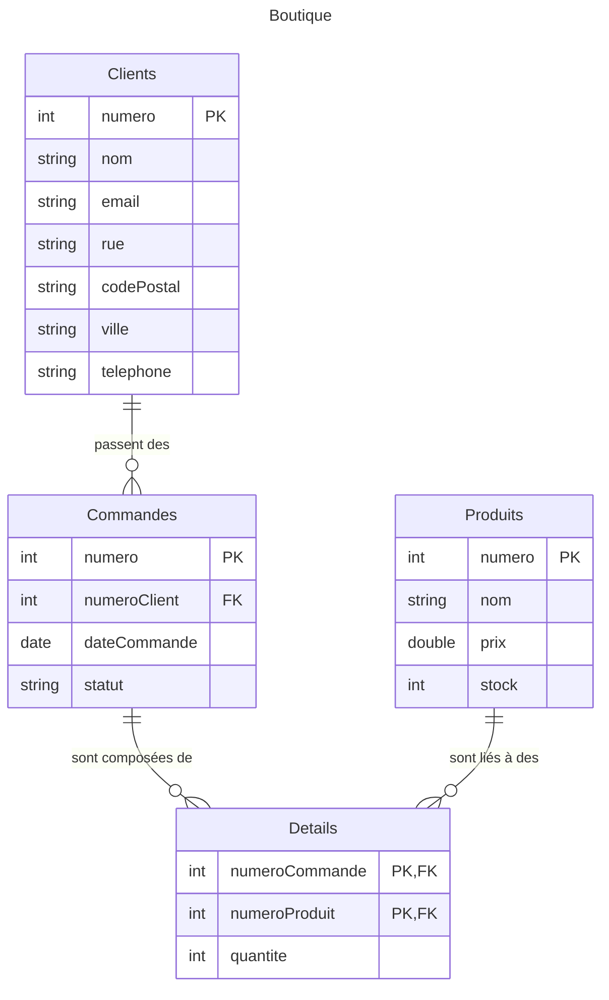

import Table from "/src/components/TableSQLite.astro";
import Slide from "/src/components/Slide.astro";

<Slide>

## Introduction sur les schémas

Les **bases de données** ont différentes **représentations** qui permettent de **visualiser** la structure des données, à différents stades de la conception

</Slide>
<Slide title="Introduction sur les schémas">

##### Le **Schéma conceptuel**

Représentation des concepts et des relations entre les concepts, qui peut être représenté de différentes manières :

* **Textuelle** : Représentation sous forme de texte des tables en précisant les clés primaires et étrangères
* **Diagramme Entités-Associations** : Représentation graphique des entités et des associations entre ces entités
* Diagramme de classe UML : ne sont pas adaptés à la représentation des bases de données relationnelles, mais souvent utilisés malgré tout

</Slide>
<Slide title="Introduction sur les schémas">

##### Le **Schéma logique**

* **Textuelle** : Similaire à la représentation textuelle du schéma conceptuel, mais avec des informations sur les types de données en plus
* **Schéma logique** : Représentation des tables et des relations entre les tables. Plus proche de la machine que le schéma conceptuel.
* Diagramme de classe UML : ne sont pas adaptés à la représentation des bases de données relationnelles, mais souvent utilisés malgré tout

</Slide>
<Slide title="Introduction sur les schémas">

Les logiciels de gestion de bases de données permettent de **créer** et de **maintenir** ces schémas.

:::note
Ces représentations n'incluent pas les données ! Le **schéma** d'une base ne doit pas être confondu avec l'**instance** d'une base
:::

</Slide>
<Slide>

## Représentation textuelle conceptuelle

On peut représenter une base de données relationnelle sous forme de texte.

Généralement, on **souligne les clés primaires** et on indique les **clés étrangères avec un astérisque**.

 

* **Clients** (<u>numero</u>, nom, email, rue, codePostal, ville, telephone)
* **Commandes** (<u>numero</u>, numeroClient*, dateCommande, statut)
* **Produits** (<u>numero</u>, nom, prix, stock)
* **Details** (<u>numeroCommande*</u>, <u>numeroProduit*</u>, Quantité)

</Slide>
<Slide>

## Schéma conceptuel (Diagramme Entités-Associations)

(Digrammes EA ou Entity-Relationship (ER) en anglais)

##### Le **schéma conceptuel** est une représentation graphique des **entités** et des **associations** entre ces entités.

Il permet de visualiser les **relations entre les entités**.

Dans notre exemple précédent, on peut identifier : 

##### Les **entités** :

Client, Produit, Commande, Détail

##### Et les **associations** :

* Un Client passe une Commande
* La Commande est comosée de Detail
* Les Detail spécifient des quantités de Produit

</Slide>
<Slide>

En schéma **Entité-Association**, cette base de données serait représentée de la sorte :

</Slide>
<Slide>
## Représentation textuelle logique

Similaire à la représentation textuelle conceptuelle, mais avec des informations sur les types de données en plus

 

* **Clients** (<u>numero</u> : _integer_, nom : _String_, email : _String_, rue : _String_, codePostal: _Number_, ville : _String_, telephone: _String_)
* **Commandes** (<u>numero</u> : _integer_, numeroClient* : _integer_, dateCommande : _DateTime_, statut : _enum('en cours', 'envoyée', 'livrée', 'annulée')_)
* **Produits** (<u>numero</u> : _integer_, nom ; _String_, prix : _Float_, stock : _integer_)
* **Details** (<u>numeroCommande*</u> : _integer_, <u>numeroProduit*</u> : _integer_, Quantité : _integer_)

</Slide>
<Slide>

## Schéma logique

Le schéma logique est une représentation des tables et des relations entre les tables plus proche de la machine que le schéma conceptuel.

Il est utilisé pour **créer** et **maintenir** la base de données.

import { Image } from "astro:assets";
import SchemaLogique from "./05-schema-01-ecommerce-fr-erd-v1.svg";

<Image src={SchemaLogique} alt="Schema Logique" />

</Slide>
<Slide>

## Conclusion sur les schémas

* Ils permettent de **visualiser** la structure d'une base de données
* Ils permettent de **comprendre** les relations entre les tables
* Ils permettent de **définir** les contraintes d'intégrité
* Ils permettent de **communiquer** sur la structure d'une base de données
* Ils permettent de **documenter** la base de données
* Les schémas ne permettent pas de **visualiser** les données elles-mêmes et il n'existe pas de schéma universel.

##### La conception et les schémas seront abordés plus en détail dans la seconde partie de ce cours

</Slide>
