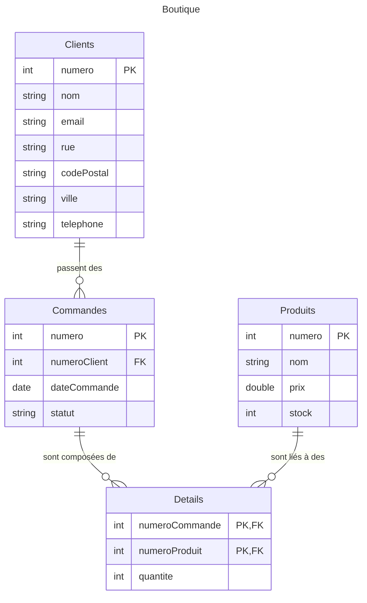

import Table from "/src/components/TableSQLite.astro";
import Slide from "/src/components/Slide.astro";

<Slide>

### Schémas

Les **bases de données** sont **représentées** sous formes **textuelles**, de **schémas conceptuels** et de **schémas logiques**.

Ces représentations n'incluent pas les données : 

:::note
Le **schéma** d'une base ne doit pas être confondu avec l'**instance** d'une base
:::

</Slide>
<Slide>

#### Représentation textuelle

On peut représenter une base de données relationnelle sous forme de texte.

Généralement, on souligne les clés primaires et on indique les clés étrangères avec un astérisque.

 

* **Clients** (<u>numero</u>, nom, email, rue, codePostal, ville, telephone)
* **Commandes** (<u>numero</u>, numeroClient*, dateCommande, statut)
* **Produits** (<u>numero</u>, nom, prix, stock)
* **Details** (<u>numeroCommande*</u>, <u>numeroProduit*</u>, Quantité)

</Slide>
<Slide>

#### Schéma conceptuel (Diagramme Entités-Associations)

(Digrammes EA ou Entity-Relationship (ER) en anglais)

Le **schéma conceptuel** est une représentation graphique des **entités** et des **associations** entre ces entités.

Il permet de visualiser les **relations entre les entités**.

Dans notre exemple précédent, on peut identifier : 

* Les **entités** :

  * Client
  * Produit
  * Commande
  * Détail

* Et les **associations** :

  * Un Client passe une Commande
  * La Commande est comosée de Detail
  * Les Detail spécifient des quantités de Produit
</Slide>
<Slide>

En schéma **Entité-Association**, ce bon de commande serait représenté de la sorte :

</Slide>
<Slide>

#### Schéma logique

Le schéma logique est une représentation des tables et des relations entre les tables plus proche de la machine que le schéma conceptuel.

Il est utilisé pour **créer** et **maintenir** la base de données.

import { Image } from "astro:assets";
import SchemaLogique from "./05-schema-01-ecommerce-fr-erd-v1.svg";

<Image src={SchemaLogique} alt="Schema Logique" />

</Slide>
<Slide>

### Conclusion sur les schémas

* Ils permettent de **visualiser** la structure d'une base de données
* Ils permettent de **comprendre** les relations entre les tables
* Ils permettent de **définir** les contraintes d'intégrité
* Ils permettent de **communiquer** sur la structure d'une base de données
* Ils permettent de **documenter** la base de données

Malheureusement, les schémas ne permettent pas de **visualiser** les données elles-mêmes et il n'existe pas de schéma universel.

</Slide>
