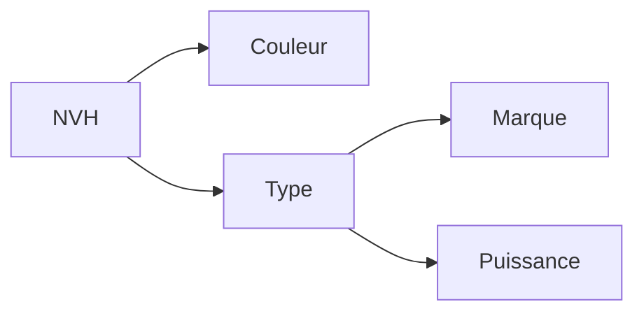
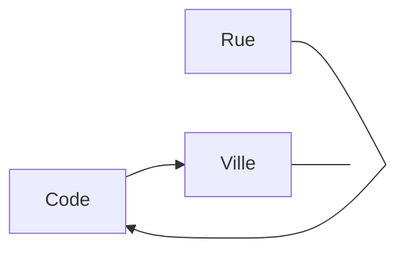

import Slide from "/src/components/Slide.astro";
import Table from "/src/components/Table.astro";

## La redondance

<Slide title="Phénomène de redondance">

:::tip[Définition]
La redondance, en bases de données, est le phénomène par lequel une même information est **stockée plusieurs fois** dans la base de données.
:::

* En bases de données **relationnelles**, on veut _absolument éviter_ la redondance des données
* La redondance est un phénomène qui peut survenir lors d'une **mauvaise conception** d'une base de données.
* La redondance peut être **interne** (au sein d'une même table) ou **externe** (entre plusieurs tables)
* La redondance peut entraîner des **problèmes de cohérence** et de maintenance des données
* La redondance peut être **évitée** en **normalisant** la base de données

</Slide>
<Slide>

### Exemple

Considérons une table _LIVRES_ contenant les informations relatives à des livres d'une bibliothèrque. 

La bibliothèque possède **plusieurs exemplaires** de chaque livre :

<Table
  title="Livres"
  headers={["numero", "titre", "auteur", "isbn", "dateAchat", "rayonnage"]}
  rows={
    [
      ["1", "Le Petit Prince", "Antoine de Saint-Exupéry", "978-2-01-000000-0", "2020-07-29", "A1"],
      ["2", "Le Petit Prince", "Antoine de Saint-Exupéry", "978-2-01-000000-0", "2020-07-29", "A1"],
      ["3", "Les misérables", "Victor Hugo", "978-2-01-000000-1", "2018-06-21", "A2"],
      ["4", "Le portrait de Dorian Gray", "Oscar Wilde", "978-2-01-000000-2", "2010-01-29", "F3"],
      ["5", "Le portrait de Dorian Gray", "Oscar Wilde", "978-2-01-000000-2", "2010-01-29", "F3"],
      ["6", "Dune", "Frank Herbert", "978-2-01-000000-3", "2015-12-12", "B4"],
    ]
  }
/>

**Problème** : Lorsqu'un livre existe en plusieurs **exemplaires**, les informations _titre_, _auteur_, _isbn_ sont **dupliquées** 


Cette situation va à l'encontre du principe fondateur des bases de données relationnelles

</Slide>
<Slide>

:::danger[Attention]
Tout **fait pertinent** du domaine d'application doit être enregistré **une et une seule fois** dans la base de données
:::

</Slide>
<Slide>

### Inconvénients

* La table occupe un espace excessif et inutile
* Les modifications sont coûteuses puisqu'il faut **mettre à jour toutes les données dupliquées** 
* Comment **garantir** que les données dupliquées restent **identiques** et **cohérentes** ? 
* Exemples : 
    * _Si le premier ajout d'un livre se fait librement, les ajouts d'un autre exemplaire doivent se faire conformément aux informations déjà saisies_
    * _L'effacement du seul exemplaire d'un livre supprimerait définitivement les informations concernant son titre et son auteur_

</Slide>
<Slide>

### Outils

Nous disposons de plusieurs outils pour **adresser** le problème de redondance des données :

* **Dépendances fonctionnelles (DF)** : Permet d'identifier les redondances et de les éliminer
* **Normalisation** : Règles et processus de **décomposition** des tables pour éviter la redondance en fonction de DF


</Slide>
## Dépendances fonctionnelles (DF)
<Slide>

### Les DF : à quoi ça sert ?

* Les **dépendances fonctionnelles** permettent de **décrire** les **contraintes** qui existent entre les **attributs** d'une relation
* Les **DF** permettent de **déterminer** les **clés** d'une relation
* Les **DF** permettent de **déterminer** les **relations** entre les **tables**
* Les **DF** permettent de **normaliser** une base de données
  * La **normalisation**, que nous allons voir par la suite, consiste à **décomposer** les tables pour éviter la redondance des données
  * La **normalisation** se fait en s'appuyant sur les **DF** pour déterminer les **clés** et les **relations** entre les tables


</Slide>
<Slide>

### Définition

En théorie des bases de données relationnelles, une **dépendance fonctionnelle** est une **contrainte entre deux ensembles d'attributs** dans une relation (table)

:::tip[Définition]
Un schéma d'une relation noté ```R = <A, {X→Y}>``` définit l'ensemble des **relations R** construites sur l'ensemble des **attributs A** qui vérifient l'ensemble des dépendances fonctionnelles **X→Y**
:::

</Slide>

##### Exemple :

<Slide title="Exemple">

* On souhaite définir une relation entre les attributs suivants : 
  * **P**rofesseur, **H**eure, **S**alle, **C**lasse, **M**atière
* On pourrait décider que l'affirmation _"le professeur **p** qui enseigne la matière **m** fait cours à l'heure **h** en salle **s** à la classe **c**"_ correspond à ce que nous souhaitons représenter dans la bdd
* Depuis cette affirmation, on peut donc déduire les dépendances fonctionnelles suivantes :
  
  * ``` { P→M,  HC→S,  PH→C,  HS→P }```

On pourra écrire cette relation de cette manière : 

``` R = <(P, H, S, C, M), {P→M, HC→S, PH→C, HS→P}> ```
  

</Slide>

##### Autre exemple :

<Slide title="Autre exemple">


Dans la relation _LIVRES_, on peut identifier une DF entre les attributs _isbn_, _titre_ et _auteur_
* Il semble que : `ISBN → TITRE, AUTEUR`
* On dit qu'ISBN est le **déterminant** et (TITRE, AUTEUR) les **déterminés** 
* Autrement dit, si on possède une valeur _isbn_, on peut **nécessairement** déterminer le _titre_ et l'_auteur_ du livre

</Slide>
<Slide>

### Axiomes d'Armstrong

Les **dépendances fonctionnelles** sont régies par les [axiomes d'Armstrong](https://en.wikipedia.org/wiki/Armstrong%27s_axioms) :

* **Réflexivité** : Si `Y` est une partie de `X`, alors `X → Y`
* **Augmentation** : Si `X → Y`, alors `XZ → YZ`
* **Transitivité** : Si `X → Y` et `Y → Z`, alors `X → Z`

</Slide>
<Slide>

#### Autres propriétés déduites des axiomes d'Armstrong

* **Pseudo-transitivité** : Si `X → Y` et `WY → Z`, alors `WX → Z`
* **Union** : Si `X → Y` et `X → Z`, alors `X → YZ`
* **Décomposition** : Si `X → YZ`, alors `X → Y` et `X → Z`
* **Réduction** : Si `X → YZ` et `X → Y`, alors `X → Z`

##### Exemple

* Si on a une dépendance fonctionnelle `ISBN → TITRE, AUTEUR`
* On peut en déduire que `ISBN → TITRE` et `ISBN → AUTEUR`

</Slide>
<Slide>

### DF élémentaires

:::tip[Définition]
Soit `G` un groupe d'attributs et `A` un attribut

Une dépendance fonctionnelle `G → A` est dite **élémentaire** si :
* `A` n'est pas incluse dans `G`
* s'il n'existe pas d'attribut `A'` de `G` qui détermine `A`
:::

* Une **dépendance fonctionnelle** est dite **élémentaire** (**DFE**) si elle ne peut pas être décomposée en plusieurs dépendances fonctionnelles plus simples
* Une **dépendance fonctionnelle** est dite **complète** si elle est **irréductible** et qu'elle ne peut pas être déduite à partir d'autres dépendances fonctionnelles

##### Exemple

* `AB → C` est élémentaire si ni `A`, ni `B` **pris individuellement** ne déterminent `C`
* `Nom, DateNaissance, LieuNaissance → Prénom` est élémentaire

</Slide>
<Slide>

### DF non élémentaires

* Une **dépendance fonctionnelle** est dite **non élémentaire** si elle peut être décomposée en plusieurs dépendances fonctionnelles plus simples
* Une **dépendance fonctionnelle** est dite **incomplète** si elle peut être déduite à partir d'autres dépendances fonctionnelles

##### Exemple

* `AB → A` n'est pas élémentaire, car A est incluse dans `AB`
* `AB → CB` n'est pas élémentaire, car `CB` n'est pas un attribut, mais un groupe d'attributs
* `N°SS → Nom, Prénom` n'est pas élémentaire

</Slide>
<Slide>

:::note[À retenir]
On peut toujours réécrire un ensemble de DF en un ensemble de DFE, en supprimant les DF triviales obtenues par réflexivité et en décomposant les DF à partie droite non atomique en plusieurs DFE.
:::

</Slide>
<Slide>

### Réécriture de DF en DFE

> On peut réécrire les DF non élémentaires de l'exemple précédent en les décomposant en DFE :

* `AB → A` n'est pas considérée, car c'est une DF _triviale_ obtenue par réflexivité
* `AB → CB` est _décomposée_ en `AB → C` et `AB → B`, et `AB → B` n'est plus considérée, car triviale
* `N°SS → Nom, Prénom` est _décomposée_ en `N°SS → Nom` et `N°SS → Prénom`

</Slide>
<Slide>

### Fermeture transitive des DFE

> On appelle fermeture transitive `F+` d'un ensemble `F` de DFE, l'ensemble de toutes les DFE qui peuvent être composées par _transitivité_ à partir des DFE de `F`.

* Soit l'ensemble `F = {A→B, B→C, B→D, A→E}.`
* La fermeture transitive de `F` est :
  * `F+ = { A→B, B→C, B→D, A→E, A→C, A→D }`

</Slide>
<Slide>

### Couverture minimale des DFE

> La **couverture minimale** d'un ensemble de DFE est un sous-ensemble minimum des DFE _permettant de générer toutes les autres DFE_.

Synonyme : Famille génératrice

:::note[Info]
Tout ensemble de DFE (et donc tout ensemble de DF) admet au moins une couverture minimale (et en pratique souvent plusieurs).
:::

##### Exemple

L'ensemble `F = {A→B, A→C, B→C, C→B}` admet les deux couvertures minimales :

`CM1 = {A→C, B→C, C→B}` et `CM2 = {A→B, B→C, C→B}`

</Slide>
<Slide>

### Graphe des DFE

> On peut représenter un ensemble de DFE par un graphe orienté, tel que les nœuds sont les attributs et les arcs les DFE

</Slide>

##### Exemples

<Slide title="Exemples">

**Relation Voiture**

Soit la relation `Voiture(Nom, Marque, Type, Puissance, Couleur)` avec l'ensemble des DF :

`F = {Nom→Type, Type→Marque, Type→Puissance, Nom→Couleur}`

On peut représenter `F` par le graphe ci-dessous :



</Slide>
<Slide title="Exemples">

**Relation CodePostal**

Soit la relation `CodePostal(Code, Ville, Rue )` avec l'ensemble des DF : 

`F={Code→Ville, (Ville,Rue)→Code}`

On peut réprésenter F par le graphe ci-dessous :




</Slide>
<Slide>

## Définition formelle d'une clé

Grâce aux dépendances fonctionnelles, on va pouvoir définir les identifiants des relations, appelés **clés**

:::tip[Définition d'une clé]
Soient une relation `R(A1,A2,...,An)` et `K` un sous-ensemble de `A1,A2,... ,An`

`K` est une clé de `R` si et seulement si :

`K→A1,A2,...,An`

et il n'existe pas de `X` inclus dans `K` tel que `X→A1,A2,...,An`
:::

> Une clé est donc un _ensemble minimum d'attributs_ d'une relation qui _détermine tous les autres_.

</Slide>
<Slide title="Définition des clés">

##### Clés candidates et clé primaire

Si une relation comporte **plusieurs clés**, chacune est dite **clé candidate** et l'on en choisit une en particulier pour être la **clé primaire**.

##### Les clés candidates sont des clés !

**Toutes les clés candidates sont des clés**, pas seulement la clé primaire.

##### Les clés candidates se déterminent mutuellement

Toute clé candidate détermine les autres clés candidates, puisque qu'une clé détermine tous les attributs de la relation.

##### Relation "toute clé"

Étant donné qu'une relation **dispose forcément d'une clé**, si une relation R n'admet aucune clé K sous ensemble des attributs A1..An de R, alors c'est que K=A1..An (la clé est composée de tous les attributs de R).

On parle de relation "toute clé".

</Slide>
<Slide>

## Exercice

import Exercice1 from '../../exercices/01-concepts/09-exercices-01-reduit.mdx'

<Exercice1 />


</Slide>
<Slide>

## Conclusions

* La **redondance des données** est un phénomène **à éviter** dans une base de données
* La redondance peut entraîner des **problèmes de cohérence** et de maintenance des données
* Les **dépendances fonctionnelles** permettent d'**identifier** les redondances
  * Les DF vont permettre de normaliser la base de données
  * La normalisation consiste à décomposer les tables en fonction des DF

Identifier les dépendances fonctionnelles est une étape importante dans la conception d'une base de données, **qui n'est pas toujours évidente**

</Slide>
