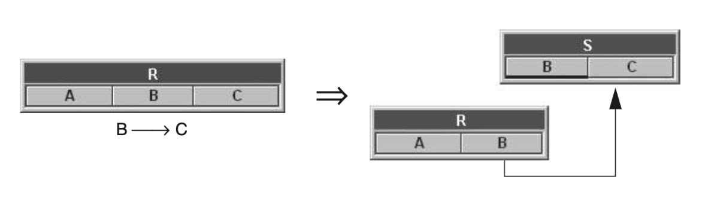

import Slide from "/src/components/Slide.astro";
import Table from "/src/components/Table.astro";

<Slide title="Phénomène de redondance">

:::note[Définition]
La redondance des données signifie que les mêmes informations sont stockées plusieurs fois dans une base de données
:::

* La redondance est un phénomène qui peut survenir lors d'une **mauvaise conception** d'une base de données.
* La redondance peut être **interne** (au sein d'une même table) ou **externe** (entre plusieurs tables)
* La redondance peut entraîner des **problèmes de cohérence** et de maintenance des données
* La redondance peut être **évitée** en **normalisant** la base de données

</Slide>
<Slide>

## Exemple

<Table
  title="Livres"
  headers={["numero", "titre", "auteur", "isbn", "dateAchat", "rayonnage"]}
  rows={
    [
      ["1", "Le Petit Prince", "Antoine de Saint-Exupéry", "978-2-01-000000-0", "2020-07-29", "A1"],
      ["2", "Le Petit Prince", "Antoine de Saint-Exupéry", "978-2-01-000000-0", "2020-07-29", "A1"],
      ["3", "Les misérables", "Victor Hugo", "978-2-01-000000-1", "2018-06-21", "A2"],
      ["4", "Le portrait de Dorian Gray", "Oscar Wilde", "978-2-01-000000-2", "2010-01-29", "F3"],
      ["5", "Le portrait de Dorian Gray", "Oscar Wilde", "978-2-01-000000-2", "2010-01-29", "F3"],
      ["6", "Dune", "Frank Herbert", "978-2-01-000000-3", "2015-12-12", "B4"],
    ]
  }
/>

* **Problème** : Lorsqu'un livre existe en plusieurs **exemplaires**, les informations _titre_, _auteur_, _isbn_ sont **dupliquées** 
* Cette situation va à l'encontre du principe fondateur des bases de données : 
    >tout fait pertinent du domaine d'application doit être enregistré **une et une seule fois**

</Slide>
<Slide>

## Inconvénients de la redondance 

* La table occupe un espace excessif et inutile
* Les modifications sont coûteuses puisqu'il faut **mettre à jour toutes les données dupliquées** 
* Comment **garantir** que les données dupliquées restent **identiques** et **cohérentes** ? 
* Exemples : 
    * Si le premier ajout d'un livre se fait librement, les ajouts d'un autre exemplaire doivent se faire conformément aux informations déjà saisies 
    * L'effacement du seul exemplaire d'un livre supprimerait définitivement les informations concernant son titre et son auteur 

</Slide>
<Slide>

## Dépendances fonctionnelles

En théorie des bases de données relationnelles, une dépendance fonctionnelle est une contrainte entre deux ensembles d'attributs dans une relation (table) d'une base de données

:::note[Définition]
Un schéma d’une relation noté ```R = <U, {X→Y}>``` définit l’ensemble des relations R construites sur l’ensemble de constituants U qui vérifient toutes la dépendance fonctionnelle X→Y
:::

</Slide>

##### Exemple :

<Slide title="Exemple">

* **P** (professeur), **H** (heure), **N** (salle), **Y** (classe), **T** (matière)
* _"le professeur **p** qui enseigne la matière **t** fait cours à l’heure **h** en salle **n** à la classe **y**"_
* On peut définir les dépendances fonctionnelles suivantes :
  
  ``` { P → T,  HY → N, PH → Y, HN → P }```

> Les dépendances fonctionnelles determinent les **dépendances** de certaines **colonnes entre elles**

</Slide>

##### Autre exemple :

<Slide title="Autre exemple">


* Dans la relation _LIVRES_ , il existe une contrainte entre les colonnes _isbn_, _titre_ et _auteur_ de la table LIVRES
* On notera :
    * ISBN → TITRE, AUTEUR 
    * ISBN est le **déterminant** et (TITRE, AUTEUR) les **déterminés** 
    * Autrement dit, si on possède une valeur _isbn_, on peut **nécessairement** déterminer le _titre_ et l'_auteur_ du livre


>On va donc garder uniquement le déterminant isbn dans la table livre, et déplacer les détérminés titre et auteur dans une nouvelle table

</Slide>
<Slide>

### Axiomes d'Armstrong

Les dépendances fonctionnelles sont régies par les **axiomes d'Armstrong** :

* **Réflexivité** : Si Y est une partie de X, alors X → Y
* **Augmentation** : Si X → Y, alors XZ → YZ
* **Transitivité** : Si X → Y et Y → Z, alors X → Z

Exemple

* Si on a une dépendance fonctionnelle ISBN → TITRE, AUTEUR
* On peut en déduire que ISBN, DATE_ACHAT → TITRE, AUTEUR, RAYONNAGE
* On peut en déduire que ISBN → RAYONNAGE

</Slide>
<Slide>

### Autres propriétés déduites des axiomes d'Armstrong

* **Union** : Si X → Y et X → Z, alors X → YZ
* **Décomposition** : Si X → YZ, alors X → Y et X → Z
* **Pseudo-transitivité** : Si X → Y et WY → Z, alors WX → Z
* **Réduction** : Si X → YZ et X → Y, alors X → Z

Exemple

* Si on a une dépendance fonctionnelle ISBN → TITRE, AUTEUR
* On peut en
    * déduire que ISBN → TITRE
    * déduire que ISBN → AUTEUR


</Slide>
<Slide>

### DF élémentaires et DF complètes

* Une **dépendance fonctionnelle** est dite **élémentaire** si elle ne peut pas être décomposée en plusieurs dépendances fonctionnelles plus simples
* Une **dépendance fonctionnelle** est dite **complète** si elle est **irréductible** et qu'elle ne peut pas être déduite à partir d'autres dépendances fonctionnelles

Exemple

* Si on a une dépendance fonctionnelle ISBN → TITRE, AUTEUR
* On ne peut pas la décomposer en ISBN → TITRE et ISBN → AUTEUR
* On ne peut pas la déduire à partir d'autres dépendances fonctionnelles


</Slide>
<Slide>

### DF non élémentaires

* Une **dépendance fonctionnelle** est dite **non élémentaire** si elle peut être décomposée en plusieurs dépendances fonctionnelles plus simples
* Une **dépendance fonctionnelle** est dite **incomplète** si elle peut être déduite à partir d'autres dépendances fonctionnelles

Exemple

* Si on a une dépendance fonctionnelle ISBN → TITRE, AUTEUR, RAYONNAGE
* On peut la décomposer en ISBN → TITRE, AUTEUR et ISBN → RAYONNAGE
* On peut la déduire à partir de ISBN → TITRE, AUTEUR


</Slide>
<Slide>

:::note
On peut toujours réécrire un ensemble de DF en un ensemble de DFE, en supprimant les DF triviales obtenues par réflexivité et en décomposant les DF à partie droite non atomique en plusieurs DFE.
:::

</Slide>
<Slide>

### Réécriture de DF en DFE

On peut réécrire les DF non élémentaires de l'exemple précédent en les décomposant DFE :

* AB→A n'est pas considérée car c'est une DF triviale obtenu par réflexivité.
* AB→CB est décomposée en AB→C et AB→B, et AB→B n'est plus considérée car triviale.
* N°SS→Nom, Prénom est décomposée en N°SS→Nom et N°SS→Prénom.


</Slide>
<Slide>

## Normalisation des tables

Pour éviter la redondance des données, on peut **normaliser** les tables en respectant les règles de normalisation suivantes :

* **1ère forme normale** : Chaque colonne doit contenir **une seule valeur**
* **2ème forme normale** : Chaque colonne doit **dépendre de la clé primaire**
* **3ème forme normale** : Chaque colonne ne doit **dépendre que de la clé primaire**
* **Forme normale de Boyce-Codd** : Chaque dépendance fonctionnelle est une **dépendance triviale** ou une **dépendance complète**

### Normalisation de la table Livres

* On va créer une nouvelle table _Ouvrages_ contenant les informations relatives aux livres
* On va créer une nouvelle table _Exemplaires_ contenant les informations relatives aux exemplaires

</Slide>
<Slide>

<Table
  title="Ouvrages"
  headers={["isbn", "titre", "auteur"]}
  rows={
    [
        ["978-2-01-000000-0", "Le Petit Prince", "Antoine de Saint-Exupéry"],
        ["978-2-01-000000-1", "Les misérables", "Victor Hugo"],
        ["978-2-01-000000-2", "Le portrait de Dorian Gray", "Oscar Wilde"],
        ["978-2-01-000000-3", "Dune", "Frank Herbert"],
    ]
  }
/>

<Table
  title="Exemplaires"
  headers={["numero", "isbn", "dateAchat", "rayonnage"]}
  rows={
    [
        ["1", "978-2-01-000000-0", "2020-07-29", "A1"],
        ["2", "978-2-01-000000-0", "2020-07-29", "A1"],
        ["3", "978-2-01-000000-1", "2018-06-21", "A2"],
        ["4", "978-2-01-000000-2", "2010-01-29", "F3"],
        ["5", "978-2-01-000000-2", "2010-01-29", "F3"],
        ["6", "978-2-01-000000-3", "2015-12-12", "B4"]
    ]
  }
/>

> En créant une deuxième table et en utilisant l'ISBN comme clé étrangère dans la table Exemplaires, on a solutionné le problème de redondance !

</Slide>
<Slide>

## Comment décomposer une table ?



* Soit une table R possédant 3 colonne A, B et C

* Il existe une dépendance fonctionnelle entre B et C (Si on connait B, alors on connait nécessairement C)
    * On doit donc **extraire la colonne C** de la table R pour éviter la redondance interne
    * La colonne **B doit être présente dans les 2 tables** pour pouvoir reconstruire l'information
    
</Slide>
<Slide>

* On peut aussi remarquer dans cet exemple que :
    * B sera une **clé étrangère** dans la table R
    * B sera une **clé primaire** dans la table S

> Il peut exister plusieurs dépendances fonctionnelles au sein d'une même table
Il faudra alors décomposer autant de fois que nécessaire pour éviter la redondance

</Slide>
<Slide>

## Conclusions

* La redondance des données est un phénomène à éviter dans une base de données
* La redondance peut entraîner des problèmes de cohérence et de maintenance des données
* La redondance peut être évitée en normalisant la base de données
* La décomposition des tables permet de respecter les règles de normalisation et d'éviter la redondance
* La décomposition des tables se fait en s'appuyant sur les dépendances fonctionnelles entre les colonnes
* Identifier les dépendances fonctionnelles est une étape importante dans la conception d'une base de données, qui n'est pas toujours évidente

</Slide>
