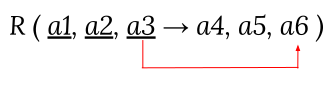
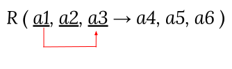

import Slide from "/src/components/Slide.astro";
import Table from "/src/components/Table.astro";

<Slide title="Objectifs de la normalisation">

:::tip[Objectifs]
**Définir des règles** pour **décomposer** les relations tout en **préservant les DF** (Dépendances Fonctionnelles), sans perdre d'informations afin de représenter les objets et les associations canoniques du monde réel
:::

La normalisation permet d'éviter :

* les anomalies de mises à jour
* les réponses erronées

Les outils de normalisation sont :

* Les **dépendances fonctionnelles**
* Les **décompositions** des tables
* Les **formes normales** (voir [Wikipedia](https://fr.wikipedia.org/wiki/Forme_normale_(bases_de_donn%C3%A9es_relationnelles)) pour des définitions plus détaillées)

</Slide>
<Slide>

## La normalisation

:::tip[Définition]
La décomposition d'une relation (d'une table) est le **remplacement** d'une relation R **par un ensemble de relations** R1,..., Rn tel que :
:::

* Les attributs de R sont **égaux à l'union** de tous les attributs des Ri
* Ri est obtenu à partir de R par **projection** sur les attributs de Ri
* **Décomposition sans perte** de sorte que l'on puisse **retrouver exactement l'information** de départ
* Une décomposition est sans perte si et seulement si elle **préserve les dépendances fonctionnelles**

> Pour obtenir une base de données de qualité, on va généralement normaliser les tables jusqu'à la 3e forme normale

</Slide>
<Slide>

## Représentation Schématique d'une relation et des DF

Nous allons illustrer les différentes formes normales par des exemples concrets, mais on peut toujours rapporter ces exemples à un schéma générique d'une relation R : 

_Relation R avec 6 attributs (a1 à a6). les trois premiers a1, a2, a3 formant le déterminant, et les trois derniers a4, a5, a6 le déterminé._

<Table
    title="Relation R"
    headers={['a1', 'a2', 'a3', 'a4', 'a5', 'a6']}
    rows={[
    ]}
/>

Les dépendances fonctionnelles (DF) de la relation R sont :

</Slide>
<Slide>

## 1ère forme normale (1FN ou 1NF)

:::tip[Définition]
Une relation est dite de **première forme normale**, si et seulement si :
* elle admet **une clé** (ou un ensemble de clés)
* tout attribut contient une **valeur atomique**
* tous les attributs sont **non répétitifs**
* tous les attributs sont **constants dans le temps**
:::
</Slide>
<Slide>

### Exemples de non-respect de la 1FN

</Slide>
<Slide title="Exemples de non-respect de la 1FN">

#### Règle : _tout attribut doit contenir une **valeur atomique**_

<Table
    title="Personnes"
    caption="Exemple de table non normalisée 1FN"
    headers={['ID', 'Nom', 'Adresse']}
    rows={[
        ['1', 'Dupont Jean', '12 rue de la Paix, Paris'],
        ['2', 'Durand Paul', '15 rue de la Liberté, Lyon']
    ]}
/>

* La colonne Nom n'est pas atomique (elle contient le prénom et le nom)
    * Il faudrait décomposer la colonne Nom en Prénom et Nom
* La colonne Adresse n'est pas atomique (elle contient le numéro, la rue, la ville et le code postal)
    * Il faudrait décomposer la colonne Adresse en Numéro, Rue, Ville et Code Postal

</Slide>
<Slide title="Exemples de non-respect de la 1FN">

#### Règle : _tous les attributs sont **non répétitifs**_

<Table
    title="Produits"
    caption="Exemple de table non normalisée 1FN"
    headers={['IDProduit', 'Description', 'Fournisseurs']}
    rows={[
        ['1', 'Téléviseur', 'Sony, Sharp, LG'],
        ['2', 'Chaîne Hifi', 'Philips, Sony']
    ]}
/>

* La colonne Fournisseurs est répétitive (elle contient plusieurs valeurs)
    * Il faudrait décomposer la colonne Fournisseurs en une table Fournisseur

</Slide>
<Slide title="Exemples de non-respect de la 1FN">

#### Règle : tous les attributs sont **constants dans le temps**

<Table
    title="Personnes"
    caption="Exemple de table non normalisée 1FN"
    headers={['ID', 'Nom', 'Prénom', 'Age']}
    rows={[
        ['1', 'Dupont', 'Jean', '25'],
        ['2', 'Durand', 'Paul', '30']
    ]}
/>

* La colonne Age n'est pas constante dans le temps
    * Il faudrait transformer la colonne _Age_ en _DateDeNaissance_

</Slide>
<Slide>

:::danger
Le **non-respect de la première forme normale** constitue une des plaies les plus importantes en matière de bases de données relationnelles et a des **conséquences catastrophiques** en matière de performances
:::

</Slide>
<Slide>

## 2ème forme normale (2FN ou 2NF)

:::tip[Définition]
Une relation est en deuxième forme normale (2FN ou 2NF) ssi :
* Elle est en première forme normale
* Tout **attribut non clé** ne dépend pas d'une **partie de clé**
:::

Autrement dit, tous les attributs non-identifiants sont totalement dépendants fonctionnellement de la totalité de l'identifiant (et donc de la clé primaire au niveau tabulaire)

</Slide>
<Slide>

### Exemples de non-respect de la 2FN

#### Règle : Tout attribut non clé **ne dépend pas d'une partie de clé**

<Table
    title="DetailsCommandes"
    headers={['numeroCommande', 'numeroProduit', 'descriptionProduit']}
    rows={[
        ['1', '1', 'Téléviseur'],
        ['2', '2', 'Chaîne Hifi'],
        ['3', '1', 'Téléviseur']
    ]}
    caption="Exemple de table non normalisée 2FN"
/>

* Dans cet exemple :
    * L'identifiant de la table est _(numeroCommande, numeroProduit)_
    * On peut déduire qu'il existe une dépendance fonctionnelle entre _numeroProduit_ et _descriptionProduit_
        * **numeroProduit → descriptionProduit**
    * La table n'est pas en 2FN car _descriptionProduit_ dépend d'une partie de la clé

:::note[Pour régler ce problème il faudrait décomposer la table en deux tables distinctes]

* **Commande**(numeroCommande, numeroProduit)
* **Produit**(numeroProduit, descriptionProduit)
:::

</Slide>
<Slide>

### Schématique du non-respect de la 2FN

> Si un attribut ne fait pas partie de la clé, il ne doit pas dépendre fonctionnellement d'une partie de la clé

</Slide>
<Slide>

## 3ème forme normale (3FN ou 3NF)

:::tip[Définition]
Une relation est en troisième forme ssi :
* Elle est en deuxième forme normale
* Tout attribut n’appartenant pas à un identifiant ne dépend pas d’un attribut non identifiant
:::

</Slide>
<Slide>

### Exemples de non-respect de la 3FN

<Table
    title="Commandes"
    headers={['numeroCommande', 'numeroClient', 'nomClient']}
    rows={[
        ['1', '1', 'Dupont'],
        ['2', '1', 'Dupont'],
        ['3', '2', 'Durand']
    ]}
    caption="Exemple de table non normalisée 3FN"
/>

* Dans cet exemple :
    * L'identifiant de la table est _(numeroCommande, numeroClient)_
    * On peut déduire qu'il existe une dépendance fonctionnelle entre _numeroClient_ et _nomClient_
        * **numeroClient → nomClient**
    * La table n'est pas en 2FN car _nomClient_ dépend d'une partie de la clé

**Pour régler ce problème**, il faudrait décomposer la table en deux tables distinctes :

* _Commande_(numeroCommande, numeroClient)
* _Client_(numeroClient, nomClient)

</Slide>
<Slide>

### Schématique du non-respect de la 3FN

> Si un attribut ne fait pas partie de la clé, il ne doit pas dépendre fonctionnellement d'un autre attribut non-clé

</Slide>
<Slide>

### La troisième forme normale :

* Retire les redondances dues aux dépendances transitives
* Permet de ne pas perdre d'information
* Permet de ne pas perdre des dépendances

:::danger[À retenir]
Un modèle relationnel **doit être** de troisième forme normale. Le respect de la 3FN ne garantit pas une absence de redondance des données d’où la FNBC détaillée ci-après.
:::

La troisième forme normale est la plus utilisée du fait de son équilibre entre redondance et performance.

> On pourra remarquer que pour certains systèmes (surtout distribués, e.g. pour certaines bases NoSQL), la redondance n'est pas un problème. 
Dans ces cas, on pourra se passer de la normalisation pour augmenter les performances.

</Slide>
<Slide>

### Forme normale de Boyce-Codd (FNBC ou BCNF ou 3.5FN)

:::tip[Définition]
Une relation est en Forme normale de Boyce-Codd ssi :
* Une relation en troisième forme normale a un identifiant composé, aucune des propriétés élémentaires de cet identifiant ne doit être en dépendance fonctionnelle d’une autre propriété
:::

> La BCNF est une forme normale plus stricte que la 3FN

</Slide>
<Slide>

### Exemples de non-respect de la FNBC

<Table
    title="Exemple de table non normalisée 3FN"
    caption="Exemple de table non normalisée FNBC"
    headers={['enseignantId', 'matiereId', 'salleId']}
    rows={[
        ['DURAND', 'CHIMIE', 'LABO CHIMIE 3'],
        ['DUPONT', 'ANGLAIS', '6A'],
    ]}
/>

* Dans cet exemple :
    * Si Durand arrête d’enseigner la Chimie, on supprime la ligne et lon perd la relation Matière-Salle
    * On peut déduire qu'il existe une dépendance fonctionnelle entre _enseignantId_ (attributs de la clé) et les 2 autres attributs (aussi attributs de la clé)

**Pour régler ce problème**, il faudrait une conception différente en plusieurs tables

:::danger[Attention]
Une décomposition en BCNF ne préserve pas toujours les DF.
:::

</Slide>
{/* <Slide>

### Schématique du non-respect de la FNBC

ou encore

> Si un attribut ne fait pas partie de la clé, il ne doit pas dépendre fonctionnellement d'un autre attribut

</Slide> */}
<Slide>

## La normalisation… Quand est-ce qu'on s'arrête ?

* Il existe les 4, 5 et 6ème formes normales. Elles évitent principalement la redondance d'information et sont plus précises
* En pratique, la 3FN est suffisante
* En effet, les projections et les jointures sont coûteuses pour le système, ainsi une trop forte normalisation diminue fortement les performances

</Slide>
<Slide>

## Conclusion

Lors de la conception d'une base de données, il est important de respecter les règles de normalisation pour éviter les problèmes de redondance et d'incohérence des données.

Voici quelques points clés à retenir sur la normalisation :

* La normalisation est un processus de conception de base de données qui permet de réduire la redondance des données
* La normalisation permet de garantir l'intégrité des données et d'éviter les anomalies
* La normalisation permet de structurer les données de manière à ce qu'elles soient faciles à maintenir et à interroger
* La normalisation est un processus itératif qui peut être long et complexe
* La normalisation est un compromis entre la performance et la structure des données

On prendra en compte chaque attribut de chaque table pour déterminer les dépendances fonctionnelles et décomposer les tables en conséquence.

</Slide>
