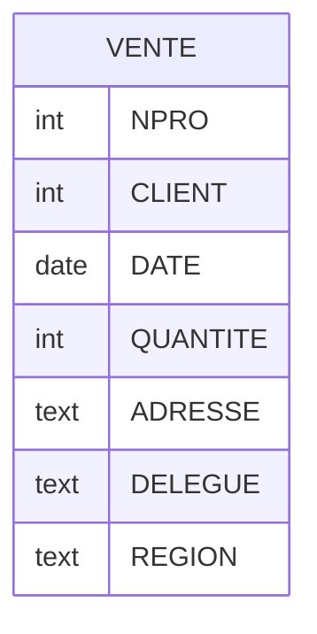
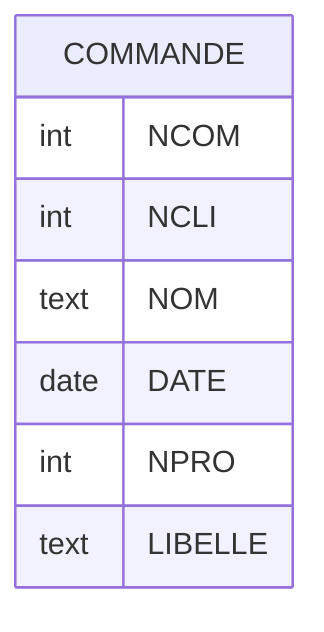

Vérifier si les schémas suivant sont normalisés.
Si nécessaire, les décomposer en tables normalisées :

## Exercice 1 :

Soit la relation :

Et les dépendances fonctionnelles :

CLIENT → ADRESSE, DELEGUE
DELEGUE → REGION

### Questions

1. Est-ce que cette relation est en 2NF ? En 3NF ? Pourquoi ?
2. Décomposer la relation en 3NF

### Solutions

## Exercice 2 :

Soit la relation :

Et les dépendances fonctionnelles :

* NCLI → NOM
* NPRO → LIBELLE

### Questions

1. Est-ce que cette relation est en 2NF ? En 3NF ? Pourquoi ?
2. Décomposer la relation en 3NF

### Solutions

