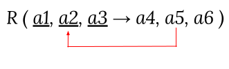
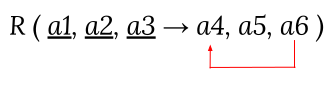

import Slide from '/src/components/Slide.astro';

<Slide title="Résumé de la partie 1. Concepts">

## Concepts

* Les concepts de **tables**, des **identifiants**, de **lignes**, de **colonnes**, **d’entités** et d'**associations**
* Les notions de **clés primaires** et **clés étrangères** qui permettent de définir la contrainte d’intégrité référentielle
* La contrainte d'unicité et la contrainte de non nullité qui garantissent l'intégrité des données
* Le problème de la **redondance interne**
* Les **dépendances fonctionnelles**
* La **normalisation** 
* La **décomposition** des tables à l’aide des dépendances fonctionnelles et des formes normales

</Slide>

## Formes Normales

<Slide title="Résumé de la partie 1. Concepts">

### Première forme normale (1NF ou 1FN)

:::tip[Définition]
Une relation est dite de première forme normale, si elle **admet une clé** et que tous ses attributs contiennent une **valeur atomique**
:::

</Slide>

<Slide title="Résumé de la partie 1. Concepts">

### Deuxième forme normale (2NF ou 2FN)

:::tip[Définition]
Une relation est en deuxième forme normale (2FN ou 2NF) ssi :
* 1. Elle est en première forme normale
* 2.** Tout attribut non clé ne dépend pas d’une partie de clé**
:::

##### Schématique de non-respect de la 2NF : 

        

</Slide>

<Slide title="Résumé de la partie 1. Concepts">

### Troisième forme normale

:::tip[Définition]
Une relation est en troisième forme ssi :
    * 1. Elle est en deuxième forme normale
    * 2. **Tout attribut n'appartenant pas à une clé, ne dépend pas d’un autre attribut non clé**
:::

##### Schématique de non respect de la 3NF : 

        

</Slide>
