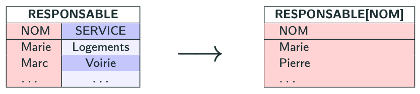

import Slide from '/src/components/Slide.astro';

<Slide title="La projection">

* **Opérandes** :
    * Une relation `R` de schéma `X`
    * `A` une sous-liste de `X`
* **Résultat** : une relation `R0` réduite aux colonnes listées dans `A`
* **Notation** : `R[A]` ou `πA(R)` (Pi)
* **Équivalence SQL** : `SELECT [colonnes]`

</Slide>
<Slide>

## Exemple de projections

Soit les relations suivantes :

```
EMPLOYE (NOM, SALAIRE, SERVICE, ADRESSE)
RESPONSABLE (NOM, SERVICE)
```
## Exemples de requêtes
1. _Donner la liste des noms de tous les employés_
2. _Pour chaque employé, donner son service et son adresse_
3. _Pour chaque employé, donner son salaire_
4. _Donner la liste des noms des responsables de service_

</Slide>
## Formes algébriques des requêtes
<Slide title="La projection">

1. _Donner la liste des noms de tous les employés :_

En algèbre relationnelle, on peut écrire :

```
EMPLOYE[NOM]      
ou
π NOM (EMPLOYE)
```

Résultat de la projection :


</Slide>
---
<Slide title="La projection">

2. _Pour chaque employé, donner son service et son adresse_

En algèbre relationnelle, on peut écrire :

```
EMPLOYE[NOM, SERVICE, ADRESSE]      
ou
π NOM, SERVICE, ADRESSE (EMPLOYE)
```

Résultat de la projection :


</Slide>
---
<Slide title="La projection">

3. _Pour chaque employé, donner son salaire_

En algèbre relationnelle, on peut écrire :

```
EMPLOYE[NOM, SALAIRE]      
ou
π NOM, SALAIRE (EMPLOYE)
```

Résultat de la projection :


</Slide>
---
<Slide title="La projection">

4. _Donner la liste des noms de tous responsables de service_

En algèbre relationnelle, on peut écrire :

```
RESPONSABLE[NOM]      
ou
π NOM (RESPONSABLE)
```

Résultat de la projection :



</Slide>

<Slide title="La projection">
## Conclusion

* La projection permet de sélectionner (_projeter_) les colonnes d'une relation
* Le **résultat** d'une projection **est une relation** de schéma `R0` constituée des colonnes listées dans `A`
* Elle permet de réduire le nombre de colonnes d'une relation.
* Elle est notée `R[A]` ou `πA(R)` (Pi).
* En SQL, elle est équivalente à `SELECT [colonnes]`.
</Slide>
