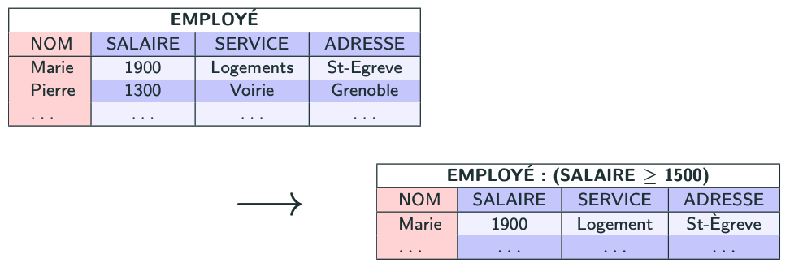

import Slide from '/src/components/Slide.astro';

<Slide title="La sélection">

* **Opérandes** :
    * Une relation `R` de schéma `X`
    * Une condition `C`
* **Résultat** : 
    * une relation `R0` de schéma `X` ne contenant que les lignes telles que la condition `C` est vraie
* **Notations possibles** : 
    * `R : C` 
    * `σC(R)` (Sigma)

</Slide>
<Slide title="La sélection">

* **Condition** : la condition est aussi appelée _critère de sélection_
    * C'est une **expression** composée :
        * de **valeurs**, par exemple, `"Marie"`
        * de **noms de colonnes** ou d'**attributs**, par exemple, `"SALAIRE"`
        * d'**opérateurs arithmétiques** `<, >, =, <=, (, )`
        * d'**opérateurs logiques** `∧, ∨, ￢`
* **Equivalence SQL** : `WHERE [condition]` 

</Slide>

## Exemples de requêtes de sélection

<Slide title="Exemples de requêtes de sélection">

_Donner les informations relatives aux employés habitant Grenoble_

```
EMPLOYE : (ADRESSE = "Grenoble")
ou
σ Adresse = "Grenoble" (EMPLOYE)
```


</Slide>
---
<Slide title="Exemples de requêtes de sélection">

_Donner les informations relatives aux employés, dont le salaire est supérieur à 1500€_

```
EMPLOYE : (SALAIRE ≥ 1500 )
ou
σ SALAIRE ≥ 1500 (EMPLOYE)
```



</Slide>
---
<Slide title="Exemples de requêtes de sélection">

_Que produit la requête :_

```
EMPLOYE : (NOM = "Marie") 
ou 
σ NOM = "Marie" (EMPLOYE)
```


</Slide>
---
<Slide title="Exemples de requêtes de sélection">


Que produit la requête : 

```
EMPLOYE : (NOM = "Marie") 
ou 
σ NOM = "Marie" (EMPLOYE)
```


</Slide>
---
<Slide title="Exemples de requêtes de sélection">

_Que produit la requête :_

```
EMPLOYE : (NOM = "Marie" ∧ ADRESSE ≠ "St-Egrève" ∧ SALAIRE < 3000 )
ou
σ NOM = "Marie" ∧ ADRESSE ≠ "St-Egrève" ∧ SALAIRE < 3000 (EMPLOYE)
```


</Slide>
---
<Slide title="Exemples de requêtes de sélection">

_Que produit la requête :_

```
EMPLOYE : (NOM = "Marie" ∧ ADRESSE ≠ "St-Egrève" ∧ SALAIRE < 3000 )
ou
σ NOM = "Marie" ∧ ADRESSE ≠ "St-Egrève" ∧ SALAIRE < 3000 (EMPLOYE)
```


</Slide>
<Slide title="La selection">

## Conclusion

* La **sélection** permet de filtrer les lignes d'une relation selon une condition.
* En algèbre relationnelle, la sélection est notée `R : C` ou `σC(R)`.
* En SQL, cela correspond à `WHERE [condition]`.

</Slide>
