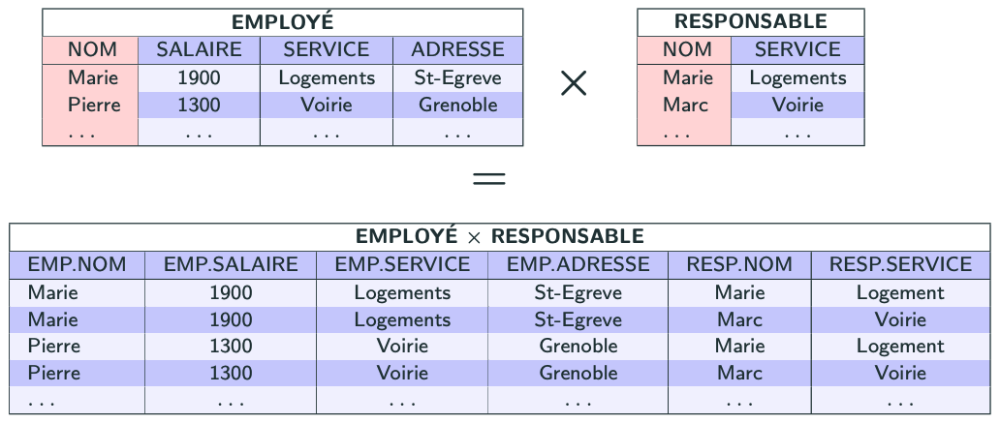

import Slide from '/src/components/Slide.astro';

<Slide title="Le produit cartésien">

* **Opérandes** :
    * Une relation `R` de schéma `X`
    * Une relation `S` de schéma `Y`
* **Résultat** : une relation `T` dont le schéma est la concaténation de `X` et de `Y`, contenant _tous les couples_ d'éléments de `R` et `S`
* **Notation** : `R × S`

</Slide>

## Exemple de produit cartésien

<Slide title="Exemple de produit cartésien">

_Quel est le produit cartésien des tables EMPLOYE et RESPONSABLE ?_

```
EMPLOYE × RESPONSABLE
```



</Slide>
<Slide title="Le produit cartésien">

## Conclusion

* Le **produit cartésien** permet de combiner toutes les paires de lignes de deux relations
* En algèbre relationnelle, le produit est noté `R × S` 
* En SQL, cela correspond à la sélection de 2 (ou plus) tables, sans poser de condition de jointure

</Slide>
