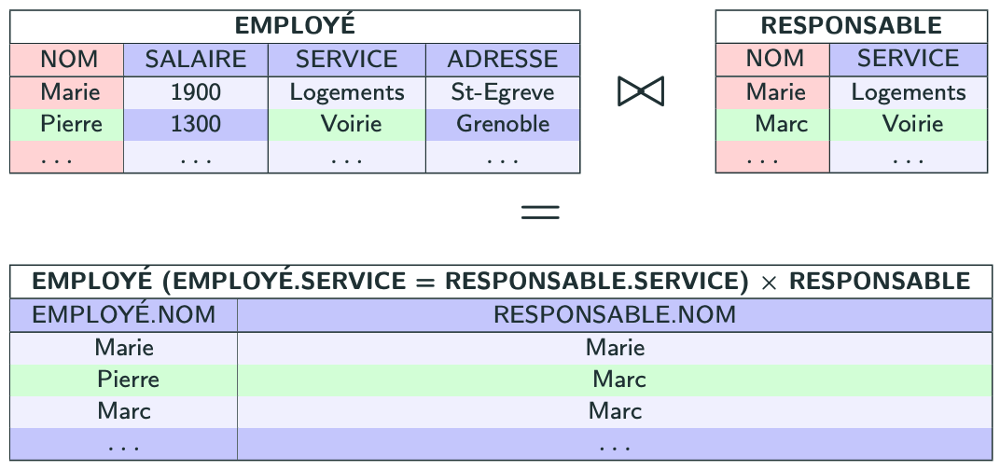
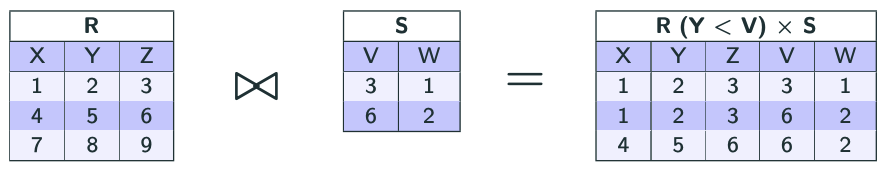

import Slide from '/src/components/Slide.astro';

<Slide title="La jointure">

_La jointure est un produit cartésien suivi d'une sélection_

* **Opérandes** :
    * Une relation `R` de schéma `X`
    * Une relation `S` de schéma `Y`
    * Une condition `C`
* **Résultat** :
    * une relation `T` dont le schéma est la concaténation de `X` et de `Y` contenant tous les couples d'éléments de `R` et `S` tels que `C` est vraie

* **Notation** :  `R(C) x S` ou  `R x S(C)` ou <code>R<sub>C</sub> ⋈ S</code> ou <code>R ⋈ S<sub>C</sub></code>
    * La _condition_ dans ce cas est aussi appelée _condition de jointure_
* Équivalent SQL : 

```
SELECT * FROM R, S WHERE C
ou 
SELECT * FROM R JOIN S ON C
```

</Slide>

## Exemples de requête de jointure

<Slide title="Exemples de requête de jointure">

_Jointure entre EMPLOYE et RESPONSABLE sur l'attribut SERVICE_

```
EMPLOYE(EMPLOYE.SERVICE = RESPONSABLE.SERVICE) x RESPONSABLE
ou
EMPLOYE x RESPONSABLE(EMPLOYE.SERVICE = RESPONSABLE.SERVICE)
ou
EMPLOYE(EMPLOYE.SERVICE = RESPONSABLE.SERVICE) ⋈ RESPONSABLE
ou
EMPLOYE ⋈ RESPONSABLE(EMPLOYE.SERVICE = RESPONSABLE.SERVICE)
```



</Slide>

## Remarque sur la condition de jointure

<Slide title="Remarque sur la condition de jointure">

* La jointure est une _mise en correspondance_ de 2 tables selon une condition
* La condition est _souvent_ une égalité entre les valeurs d'un attribut commun aux 2 tables
* Cependant, la condition de jointure peut être d'une autre nature , par exemple :




</Slide>
<Slide>
## Conclusion sur la jointure

* La **jointure** est un produit cartésien, suivi d'une sélection
* En algèbre relationnelle, la jointure est notée :
    * `R(C) x S` ou  `R x S(C)` ou <code>R<sub>C</sub> ⋈ S</code> ou <code>R ⋈ S<sub>C</sub></code>
* En SQL, cela correspond à la sélection de 2 (ou plus) tables, **en posant une condition de jointure**
* La condition de jointure est souvent une égalité entre les valeurs d'un attribut commun aux 2 tables, mais peut être d'une autre nature

</Slide>
