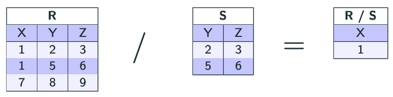
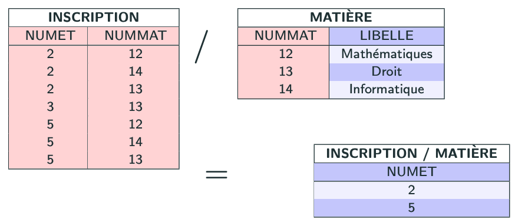
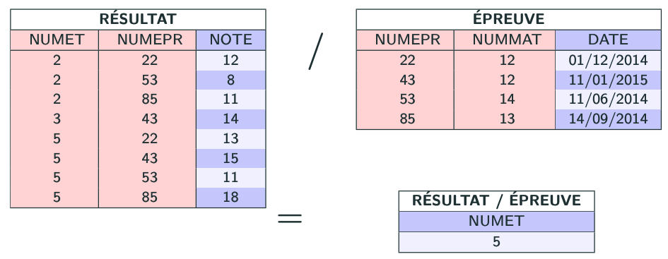
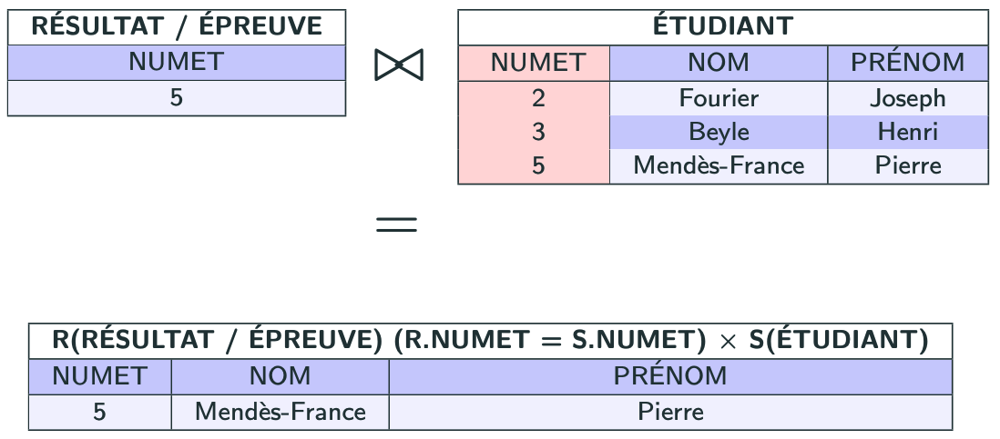

import Slide from '/src/components/Slide.astro';

<Slide title="La division">

* **Opérandes** :
    * Une relation `R` de schéma `X`
    * Une relation `S` de schéma `Y`
* **Résultat** : 
    * une relation `T` de schéma `X - Y` (les attributs de `Y` sont retirés de `X`) 
    * ne contenant _aucune des lignes_ `(v1, v2,..., vn)`
    * telles que pour chaque ligne `(w1, w2,..., wn)` de `S`
    * `R` contient les lignes `(v1, v2,..., vn, w1, w2,..., wn)`
* **Notation** : `R / S`

</Slide>
---
<Slide title="La division">

## Théorie de la division

La division de `R1` par `R2` :

* sachant que `R1` et `R2` ont au moins un attribut commun (de même nom et domaine)

produit une relation `R3` : 
* qui comporte les attributs appartenant à `R1` **mais n'appartenant pas** à `R2`
* et l'ensemble des tuples (lignes), qui concaténés à ceux de `R2` donnent toujours un tuple de `R1`



</Slide>

## Exemples de division

<Slide title="Exemples de requêtes de division">

##### Soients les relations suivantes :

```
ETUDIANT (NUMET , NOM, PRENOM)
MATIERE (NUMMAT, LIBELLE)
EPREUVE (NUMEPR , NUMMAT, DATE)
INSCRIPTION (NUMET, NUMMAT)
RESULTAT (NUMET, NUMEPR , NOTE)
```

##### Questions

* Quels sont les étudiants inscrits dans toutes les matières ?
* Quels sont les étudiants ayant une note à chacune des épreuves ?

</Slide>
---
<Slide title="Exemples de requêtes de division">

_Quels sont les étudiants inscrits dans toutes les matières ?_

```
INSCRIPTION / MATIERE
```



</Slide>
---
<Slide title="Exemples de requêtes de division">

_Quels sont les étudiants ayant une note à chacune des épreuves ?_

```
RESULTAT / EPREUVE
```



</Slide>
## La division + une jointure
<Slide title="La division + une jointure">

_Si l'on veut maintenant les noms et prénoms des étudiants ayant obtenus une note à chacune des épreuves :_

```
R = RESULTAT / EPREUVE
S = ETUDIANT[ NUMET, NOM, PRENOM ]
R (R.NUMET = S.NUMET) X S
```



</Slide>

## Conclusion sur la division
<Slide title="Conclusion sur la division">

* La **division** est une opération **complexe** et **peu intuitive**
* Cependant, elle est **très utile** pour certaines requêtes qui sont **difficiles à implémenter** en SQL
    * Par exemple, les requêtes de type "pour tous" ou "pour chaque"
    * En SQL, il n'existe pas d'opérateur de division, il faut utiliser des jointures complexes pour simuler la division
    * Il sera donc souvent plus simple de réaliser ces requêtes d'abord en algèbre relationnelle avant de les traduire en SQL
* En algèbre relationnelle, la division est notée `R / S`

</Slide>
