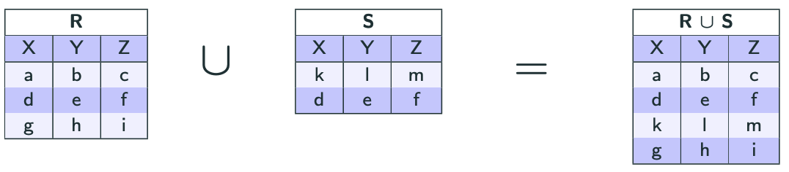

import Slide from '/src/components/Slide.astro';

<Slide title="L'union">

* **Opérandes** :
    * Une relation `R` de schéma `X`
    * Une relation `S` de schéma `X`
* **Résultat** : une relation `T` de schéma `X` contenant toutes lignes de `R` et de `S`
* **Notation** : `R U S` ou `R ∪ S`
* **Equivalence SQL** : 

```
SELECT * FROM R
UNION 
SELECT * FROM S
```
* **Remarque** : `R` et `S` doivent avoir le même schéma

</Slide>
## Exemple d'union
<Slide title="Exemple d'union">


```
R ∪ S
```



Remarques : 

* La ligne `[d, e, f]` n’apparaît qu’une seule fois dans la relation `R ∪ S`
* Une union définit _un ensemble_

</Slide>

<Slide title="L'union">

## Conclusion

* L'**union** permet de combiner les lignes de deux relations
    * _Contrairement aux jointures, qui combinent les colonnes_
* En algèbre relationnelle, l'union est notée `R U S` ou `R ∪ S`
* En SQL, cela correspond à la sélection de 2 (ou plus) tables, sans doublons

</Slide>
