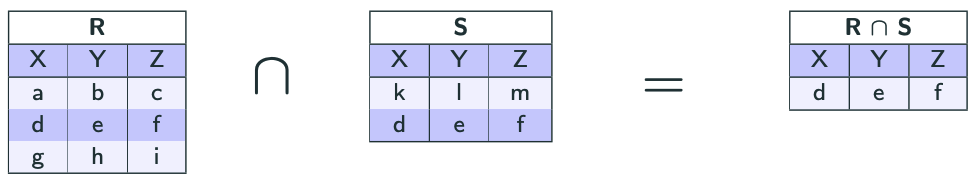

import Slide from '/src/components/Slide.astro';

<Slide title="L'intersection">

* **Opérandes** :
    * Une relation `R` de schéma `X`
    * Une relation `S` de schéma `X`
* **Résultat** : une relation **T** de schéma **X** ne contenant que les lignes qui sont à la fois dans `R` et dans `S`
* **Notation** : `R ∩ S`
* **Equivalence SQL** (_varie en fonction des SGBD_) : 

```
SELECT * FROM R
INTERSECT
SELECT * FROM S
```

* **Remarque** : `R` et `S` doivent avoir le même schéma


</Slide>

## Exemple d'intersection

<Slide title="Exemple d'intersection">



</Slide>

<Slide title="L'intersection">

## Conclusion

* L'**intersection** permet de combiner les lignes communes de deux relations en ne conservant que les lignes qui sont présentes dans les deux relations
    * _Contrairement aux jointures, qui combinent les colonnes_
* En algèbre relationnelle, l'intersection est notée `R ∩ S`
* En SQL, la syntaxe de l'intersection varie en fonction des SGBD

</Slide>
