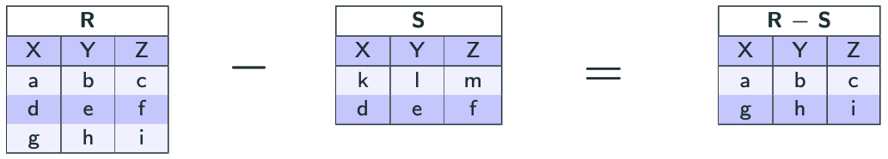

import Slide from '/src/components/Slide.astro';

<Slide title="La différence">

* **Opérandes** :
    * Une relation `R` de schéma `X`
    * Une relation `S` de schéma `X`
* **Résultat** : une relation `T` de schéma `X` contenant que les lignes de `R` _qui ne sont pas_ dans `S`
* **Notation** : `R - S`
* **Equivalence SQL** : `EXCEPT` ou `MINUS`
* **Remarque** : `R` et `S` doivent avoir le même schéma

</Slide>

## Exemple de différence

<Slide title="Exemple de différence">

</Slide>

<Slide title="La différence">

## Conclusion

* La **différence** permet de combiner les lignes de deux relations en ne conservant que les lignes qui sont présentes dans la première relation, mais pas dans la seconde
* En algèbre relationnelle, la différence est notée `R - S`
* En SQL, la syntaxe de la différence varie en fonction des SGBD

</Slide>
