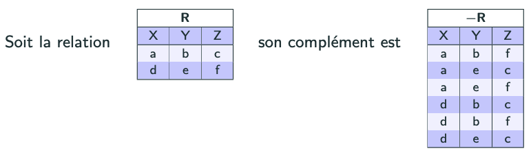

import Slide from '/src/components/Slide.astro';

<Slide title="Le complément">

* **Opérandes** :
    * Une relation `R` de schéma `X`
* **Résultat** : une relation `R0` de schéma `X` regroupant exclusivement toutes les occurrences possibles créées à partir des valeurs d'attributs présentes dans la relation `R`, à l'exception des occurrences de `R`
* **Notation** : `-R`
* **Remarques** :
    * Comme l'ensemble des valeurs possibles pour chaque attribut est généralement inconnu ou infini, seules les valeurs déjà présentes dans un attribut de R sont utilisées, dans cet attribut, pour créer de nouvelles occurrences
    * Si `R` est vide, la relation qui résulte du complément est vide
    * Propriété :   `- - R = R`

</Slide>

## Exemple de complément

<Slide title="Exemple de complément">

</Slide>

<Slide title="Le complément">

## Conclusion

* Le **complément** permet de créer une relation contenant toutes les occurrences possibles, à partir des valeurs d'attributs présentes dans une relation, à l'exception des occurrences de cette relation
* En algèbre relationnelle, le complément est noté `-R`
* La différence n'est pas un opérateur standard en SQL, mais peut être simulée avec des jointures et des sous-requêtes

</Slide>
