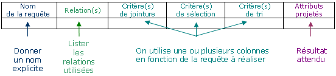

import Slide from '/src/components/Slide.astro';

<Slide>

## Règles

L'**ordre** dans lequel s'effectue les opérateurs ont un **impact sur les performances** des SGBD : 

* Les **sélections** _diminuent_ le nombre de lignes et donc la taille des tables
* Les **projections** _diminuent_ un peu la taille des tables
* Les **produits cartésiens** et les **jointures** _augmentent_ considérablement la taille des tables

</Slide>
<Slide>

_Pour ces raisons_, il est important d'effectuer les opérateurs dans l'ordre suivant :

1. Sélections (qui diminuent beaucoup la taille des tables)
2. Projections (qui diminuent un peu la taille des tables)
3. jointures et produits (qui augmentent beaucoup la taille des tables)

</Slide>
<Slide>

## Formulation des requêtes complexes

Quand on rédige des requêtes complexes en algèbre relationnelle, la lecture et l'écriture deviennent vite fastidieuses

Pour faciliter la tâche, on pourra s'aider de ce tableau qui permet de placer les différents éléments de la requête avant de la rédiger en algèbre relationnelle




Une fois les différents éléments identifiés dans le tableau, la conversion en requête algébrique sera plus simple


</Slide>
<Slide>

## Rédaction des requêtes

Lorsqu'une requête est complexe ou nécessite beaucoup d'étapes, on peut la découper en plusieurs requêtes.

Par exemple :

```
R1 = EMPLOYE (EMPLOYE.SERVICE = RESPONSABLE.SERVICE ) x RESPONSABLE
R2 = R1[NOM]
R3 = ...
```

* Ici, au lieu de projeter la colonne NOM directement, on a d'abord nommé la jointure R1. 
* On pourra ensuite utiliser R1 dans la suite de notre écriture. 
* Cet exemple est très simple, mais il est possible de définir autant de Rn relations et de les utiliser ensuite.

</Slide>
