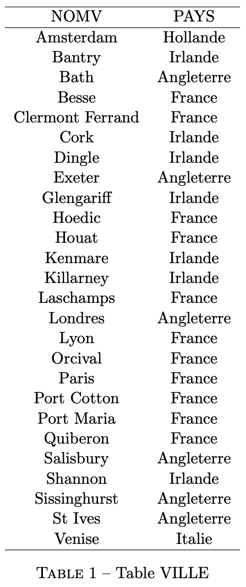
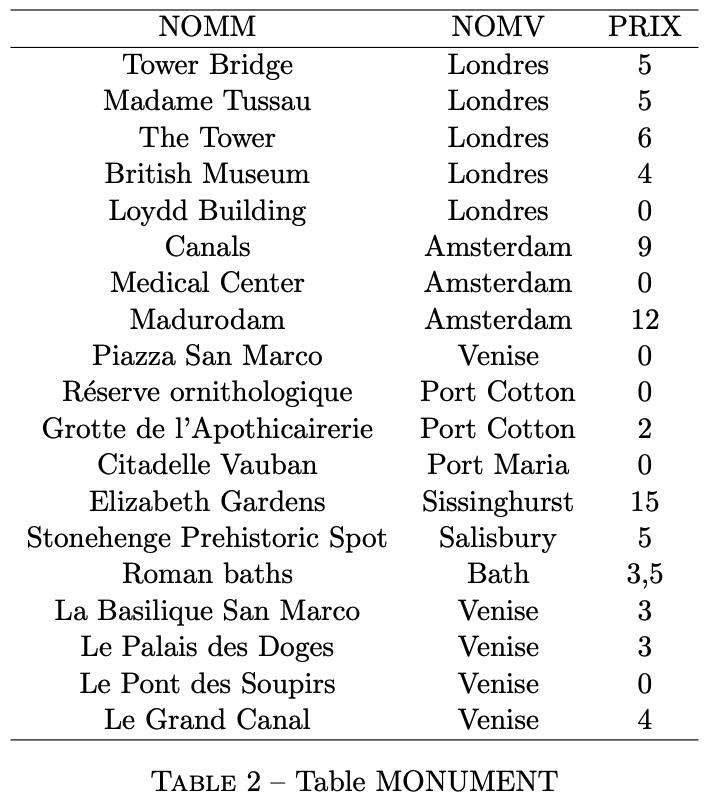
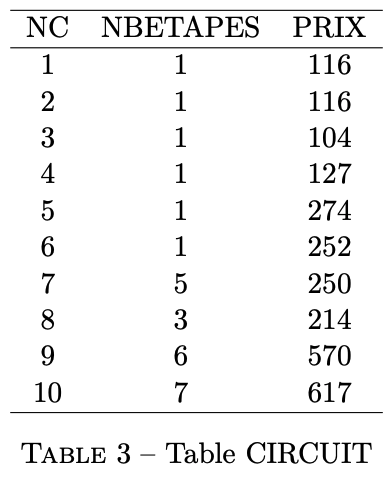
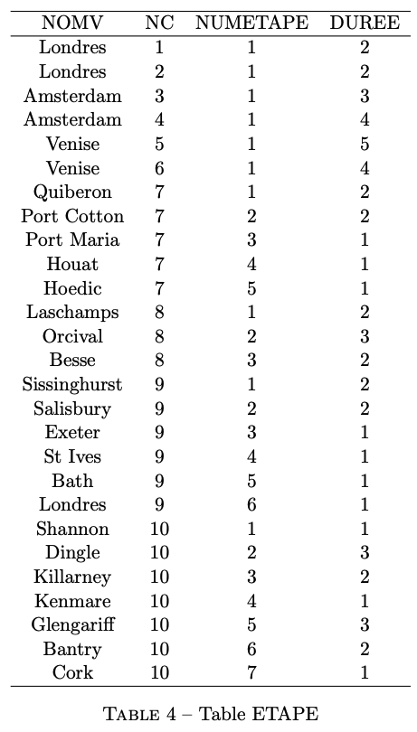
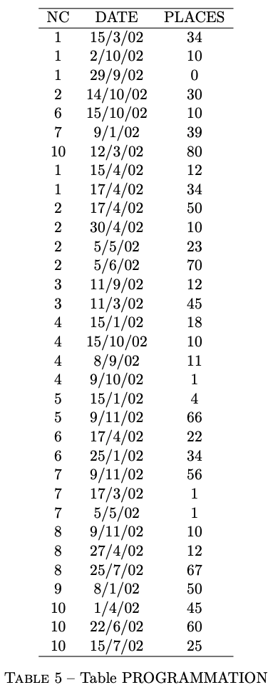
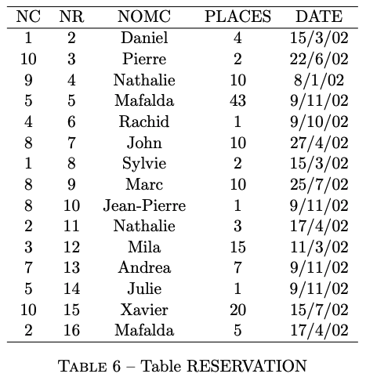

## 1. Description du problème

Une agence de voyages veut informatiser la gestion des voyages qu’elle propose (itinéraires, monuments visités, réservations, etc.). 

Une base de données doit être construite à partir du cahier des charges suivant : 


* **Les circuits** : un circuit est identifié par un numéro, un nombre d’étapes et une séquence d’étapes. Une étape se déroule pendant un nombre donné de jours, dans une ville donnée. Au cours de chaque étape, tous les monuments de la ville, lorsqu’il y en a, sont visités. Un même circuit ne repasse jamais plusieurs fois dans la même ville, mais il peut arriver que la ville de départ ou d’arrivée figure aussi parmi les villes étapes. Les villes sont identifiées par leurs noms. Les monuments sont identifiés par leurs noms dans la ville où ils sont situés. 

    Un circuit peut être programmé plusieurs fois, à des dates différentes. A chacune de ces programmations, on associe un nombre de places. Deux programmations d’un même circuit peuvent avoir des nombres de places différents. Par contre, le prix d’un circuit est toujours le même quelle que soit sa date de programmation. La durée d’un circuit est égale à la somme des durées de chacune de ces étapes ; 
* **Les réservations** : une réservation, identifiée par un numéro, est effectuée pour le compte d’un client (identifié par son nom) et concerne une programmation d’un circuit. Plusieurs places pour la même programmation du même circuit peuvent être réservées en une seule fois.

## 2. Schéma des tables

Le schéma retenu pour la base de données est constitué des relations suivantes ; 

_Par convention, on <u>souligne</u> les clés primaires et on indique les clés étrangères avec un astérisque *_

```ansi wrap
VILLE (NOMV, PAYS)
{(n, p) ∈ VILLE ↔ la ville dont le nom est n, est située dans la pays p}

MONUMENT (NOMM, NOMV*, PRIX)
{(nm, nv, p) ∈ MONUMENT ↔ le monument de nom nm est situé dans la ville nv. La visite coûte p francs}

CIRCUIT (NC, NBETAPES, PRIX)
{(nc, nb, p) ∈ CIRCUIT ↔ le circuit est identifié par le numéro nc. Il comprend nb étapes et vaut p francs}

ETAPE (NOMV, NC, NUMETAPE, DUREE)
{(nv, nc, nu, no, d) ∈ ETAPE ↔ la ville nv est la nu ième étape du circuit nc. L’étape dure d jours}

PROGRAMMATION (NC, DATE, PLACES)
{(nc, d, p) ∈ P ROGRAMMATION ↔ le circuit nc est programmé à la date d. P places sont disponibles}

RESERVATION (NC, NR, NOMC, PLACES, DATE)
{(nc, nr, c, p, d) ∈ RESERVATION ↔ le client de nom c a réservé p places pour le circuit nc commençant à la date d. Sa réservation est identifiée par le numéro nr}
```

Les domaines associés aux différents attributs sont :

```sql wrap
domaine(NOMC) = {“Mila”, “Nathalie”, “John”, etc.}
domaine(NOMV) = {“Paris”, “Londres”, “Exeter”, etc.}
domaine(PAYS) = {“France”, “Angleterre”, “Irlande”, etc.}
domaine(NC) = domaine(NR) = domaine(PLACES) = domaine(PRIX) = domaine(NUMETAPE) = domaine(NBETAPES) = domaine(DUREE) = entiers ≥ 0
domaine(DATE) = dates
```

Les contraintes d’intégrité référentielle () sont :

```
RESERVATION[NC, DATE] ⊂ PROGRAMMATION[NC, DATE]
CIRCUIT[NC] = PROGRAMMATION[NC]
CIRCUIT[NC] = ETAPE[NC]
VILLE[NOMV] = ETAPE[NOMV]
MONUMENT[NOMV] ⊂ VILLE[NOMV]
```

{/* <div class="masonry">
    
    
    
    
    
    
</div> */}

<div class="page-break"></div>

## 3. Données de la base de données


<div class="page-break"></div>
<div class="page-break"></div>

## 4. Navigation dans la base de données

Trouver les informations suivantes dans la base de données :

1. Ville de départ du circuit 10 ?
2. Noms des monuments visités par Mafalda ?
3. Nombre de places mises à la vente pour le circuit 5 à la date du 9/11/02 ?

## 5. Requêtes

Donner en algèbre relationnelle l’expression des requêtes suivantes :

1. Ville de départ du circuit 10 ?
2. Noms des monuments visités par Mafalda ?
3. Donner le numéro, les villes de départ et d’arrivée des circuits qui démarrent après une date donnée ;
4. Donner les noms des clients qui ont réservé des circuits qui passent par un pays donné ;
5. Donner le nom des clients qui ne visitent aucun monument ;
6. Donner le numéro, le prix de base (i.e. ne tenant pas compte du prix des monuments visités), et la date de départ des circuits qui ont encore des places disponibles ;
7. Donner le numéro et le prix de base des circuits qui n’ont aucune réservation ;
8. Donner les noms des pays, des villes et des monuments visités par un client donné ;
9. Donner la liste des numéros de circuits qui passent dans toutes les villes d’un pays donné
10. Pour chaque circuit restant dans le même pays, donner le nom de ce pays et le numéro de circuit.
