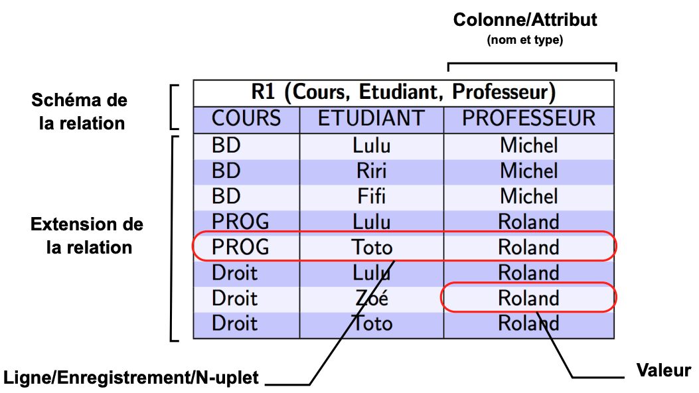

import Slide from '/src/components/Slide.astro';

<Slide title="Résumé de la partie 2. Algèbre Relationnelle">

* Langage à base d'**opérateurs algébriques** permettant de **manipuler** les données des bdd relationnelles

* **Notation** : textuelle ou mathématique

* Opérations : **Projection, Sélection, Jointure, Division, Union, Intersection, Différence**

* Une TABLE = une RELATION

* On pourra faire référence à un attribut d'une relation en utilisant la notation : **Relation.Attribut**


</Slide>

<Slide title="Résumé de la partie 2. Algèbre">



</Slide>

<Slide title="Résumé de la partie 2. Algèbre">

## Exemple d'une requête en algèbre relationnelle :

Version textuelle :

_Donner le numéro, les villes de départ et d'arrivée des circuits qui démarrent après une date donnée ;_

```
R1 = PROGRAMMATION : ( DATE > "9/2/02" ) [NC] -- j'isole par date
R2 = ETAPE ( ETAPE.NC = CIRCUIT.NC ) x CIRCUIT -- je joins en relation ETAPE et CIRCUIT
R3 = R2 : ( NUMETAPE = 1 ∨ NUMETAPE = NBETAPES ) -- J'isole les étapes départ et arrivée
R4 = R1 ( R1.NC = R3.NC ) x R3 -- je joins mes NC de R1 et ceux de R3
R5 = R4 [NC, NOMV]
```

Version mathématique :

```
R1 = π NC ( σ DATE > "9/2/02" (PROGRAMMATION) )
R2 = ( ETAPE ⨝ ( ETAPE.NC = CIRCUIT.NC ) CIRCUIT )
R3 = σ NUMETAPE = 1 ∨ NUMETAPE = NBETAPES (R2)
R4 = R1 ( R1.NC = R3.NC ) ⨝ R3 
R5 = π NC, NOMV (R4)
```


</Slide>
