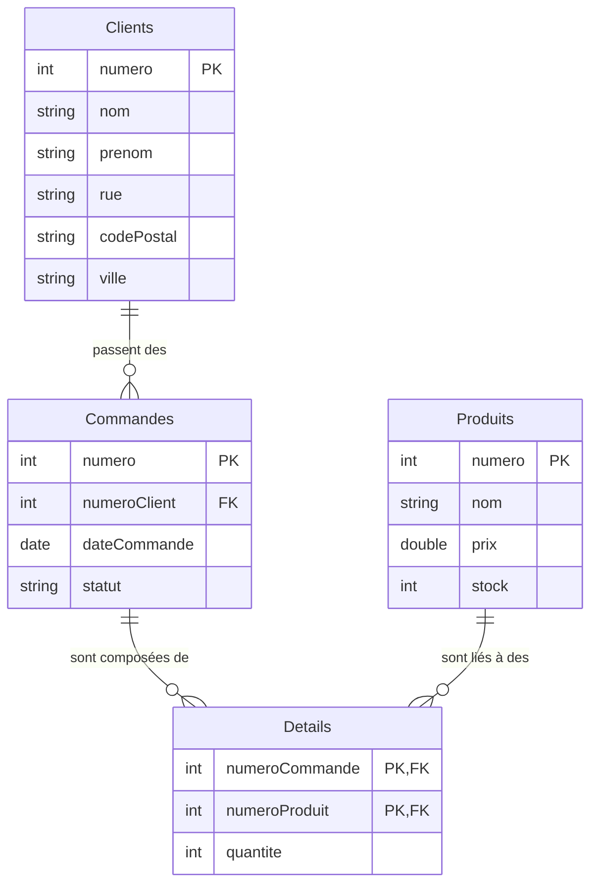

import Slide from '/src/components/Slide.astro';

<Slide>
## L'exemple fil rouge du cours

Tout au long de ce cours, nous allons travailler sur un exemple fil rouge : une base de données simplifiée d'une boutique en ligne.

### Représentation textuelle

```ansi
Clients (numero, nom, prenom, rue, codePostal, ville)
Commandes (numero, numeroClient*, dateCommande, statut)
Produits (numero, nom, prix, stock)
Details (numeroCommande*, numeroProduit*, quantite)
```
</Slide>
<Slide>

### Diagramme Entité-Association



</Slide>
<Slide>

### Jeu de données

import DBecommerce2 from '/src/components/DBecommerce2.astro'

<DBecommerce2 />


</Slide>
<Slide title="Jeu de données">

Scénario de données (amené à évoluer) :

* Le client 1 a commandé tous les produits en 2 commandes (la commande 1 et 2)
* Le client 2 n'a rien commandé
* Le client 3 a commandé tous les produits en 1 commande (la commande 3)
* Le client 4 a commandé 2 produits en 1 commande (la commande 4)
* Le client 5 a commandé 3 produits en 1 commande (la commande 5)

</Slide>
<Slide>

### Téléchargements

Vous pouvez télécharger cette base de données dans différents formats :


* Images en [png](/bdd/public/sample/ecommerce/ecommerce-fr-erd-v2.png) ou [svg](/bdd/public/sample/ecommerce/ecommerce-fr-erd-v2.svg)
* SQLite [ecommerce-fr-erd-v2.sqlite](/public/sample/ecommerce/ecommerce-fr-erd-v2.sqlite)
* Le [code SQL des tables](/public/sample/ecommerce/ecommerce-fr-erd-v2-sqlite.sql) (sans les données)
* Le script PHP pour générer la base avec données, pour SQLite [ecommerce-fr-erd-v2.php](/public/sample/ecommerce/ecommerce-fr-erd-v2-data.php)

</Slide>
<Slide>

</Slide>
<Slide>

</Slide>
<Slide>

</Slide>
<Slide>

</Slide>
<Slide>

</Slide>
<Slide>

</Slide>
<Slide>

</Slide>
<Slide>

</Slide>
