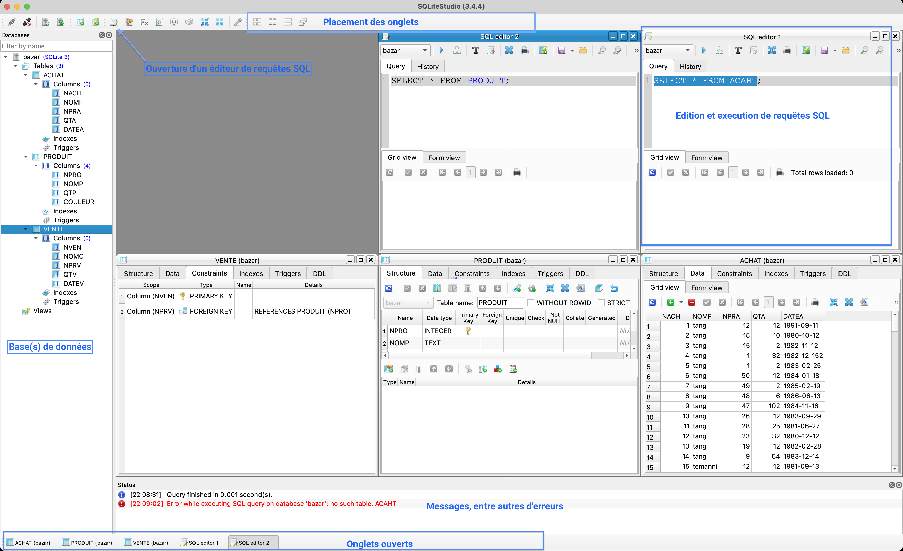

import { Tabs, TabItem } from '@astrojs/starlight/components';
import Slide from '/src/components/Slide.astro';

<Slide title="Installation de SGBD">

Comme nous l'avons déjà mentionné, il existe de nombreux systèmes de gestion de bases de données relationnelles.

:::danger[Attention]
Il faut bien différencier :
* Les **SGBD-R** (Sqlite, MySQL, PostgreSQL, Oracle, SQL Server, etc.) qui sont les **logiciels de gestion** des bases de données relationnelles d'une part
* Des **interfaces graphiques** (SQLite Studio, DBeaver, PhpMyAdmin, MySQL Workbench, PG Admin, SQL Server Management Studio, etc.) d'autre part, qui permettent de se connecter aux SGBD-R et de les manipuler de manière plus conviviale.
:::

Par défaut, les SGBD-R ne sont pas dotés d'interfaces graphiques, **uniquement d'un accès par terminal**.

</Slide>
<Slide>

## Le SGBD SQLite

SQLite est un SGBD-R **léger**, **rapide**, **sans serveur** et **sans configuration**. 

* Il est **idéal pour le développement d'applications mobiles** et est présent dans de nombreuses applications Android et iOS.
* Il est **intégré** et compatible dans de nombreux langages de programmation (Python, PHP, Java, etc.).
* Il est **simple à utiliser** et **idéal pour les petites applications**.
* SQLite stocke les bases de données dans un **fichier unique**.
* Cependant, il est **limité** pour les **applications nécessitant des performances élevées**, la gestion de **gros volumes de données** et la **gestion de plusieurs utilisateurs**.

</Slide>
<Slide>

### Installation

Si ce n'est pas déjà fait, installez [SQLite](https://www.sqlite.org/index.html) sur votre machine :

<Tabs>
  <TabItem label="Linux">
    ```bash
    sudo apt-get install sqlite3
    ```
  </TabItem>
  <TabItem label="MacOS">
    ```bash
    brew install sqlite3
    ```
  </TabItem>
  <TabItem label="Windows">
    Téléchargez et installer l'exécutable sur le [site officiel](https://www.sqlite.org/download.html)
  </TabItem>
</Tabs>

</Slide>
<Slide>

### Utilisation dans un terminal

_Pour les utilisateurs de **Windows**, préférez l'utilisation du terminal [PowerShell](https://learn.microsoft.com/en-us/powershell/)._

Pour plus de facilité, vous pouvez utiliser les terminaux intégré à VSCode.

Pour utiliser SQLite dans un terminal en mode interactif, il suffit de taper la commande `sqlite3` :

```bash
sqlite3
```

</Slide>
<Slide title="Utilisation dans un terminal">

Une fois dans le terminal SQLite, vous pouvez entrer des **commandes SQLite** pour piloter/configuer le sgbd d'une part, et exécuter des **requêtes SQL** d'autre part.

Les commandes SQLite sont précédées d'un point `.`

Par exemple, la commande `.help` affiche l'aide et la liste des commandes disponibles : 

```sql
.help
```

<details>
<summary>Exemple de sortie</summary>

```bash
sqlite> .help

.archive ...             Manage SQL archives
.auth ON|OFF             Show authorizer callbacks
.backup ?DB? FILE        Backup DB (default "main") to FILE
.bail on|off             Stop after hitting an error.  Default OFF
.cd DIRECTORY            Change the working directory to DIRECTORY
.changes on|off          Show number of rows changed by SQL
.check GLOB              Fail if output since .testcase does not match
.clone NEWDB             Clone data into NEWDB from the existing database
.connection [close] [#]  Open or close an auxiliary database connection
.databases               List names and files of attached databases
.dbconfig ?op? ?val?     List or change sqlite3_db_config() options
.dbinfo ?DB?             Show status information about the database
.dump ?OBJECTS?          Render database content as SQL
.echo on|off             Turn command echo on or off
.eqp on|off|full|...     Enable or disable automatic EXPLAIN QUERY PLAN
.excel                   Display the output of next command in spreadsheet
.exit ?CODE?             Exit this program with return-code CODE
.expert                  EXPERIMENTAL. Suggest indexes for queries
.explain ?on|off|auto?   Change the EXPLAIN formatting mode.  Default: auto
.filectrl CMD ...        Run various sqlite3_file_control() operations
.fullschema ?--indent?   Show schema and the content of sqlite_stat tables
.headers on|off          Turn display of headers on or off
.help ?-all? ?PATTERN?   Show help text for PATTERN
.hex-rekey OLD NEW NEW   Change the encryption key using hexadecimal
.import FILE TABLE       Import data from FILE into TABLE
.import FILE TABLE       Import data from FILE into TABLE
.indexes ?TABLE?         Show names of indexes
.limit ?LIMIT? ?VAL?     Display or change the value of an SQLITE_LIMIT
.lint OPTIONS            Report potential schema issues.
.log FILE|on|off         Turn logging on or off.  FILE can be stderr/stdout
.mode MODE ?OPTIONS?     Set output mode
.nonce STRING            Suspend safe mode for one command if nonce matches
.nullvalue STRING        Use STRING in place of NULL values
.once ?OPTIONS? ?FILE?   Output for the next SQL command only to FILE
.open ?OPTIONS? ?FILE?   Close existing database and reopen FILE
.output ?FILE?           Send output to FILE or stdout if FILE is omitted
.parameter CMD ...       Manage SQL parameter bindings
.print STRING...         Print literal STRING
.progress N              Invoke progress handler after every N opcodes
.prompt MAIN CONTINUE    Replace the standard prompts
.quit                    Stop interpreting input stream, exit if primary.
.read FILE               Read input from FILE or command output
.recover                 Recover as much data as possible from corrupt db.
.rekey OLD NEW NEW     Change the encryption key
.restore ?DB? FILE       Restore content of DB (default "main") from FILE
.save ?OPTIONS? FILE     Write database to FILE (an alias for .backup ...)
.scanstats on|off|est    Turn sqlite3_stmt_scanstatus() metrics on or off
.schema ?PATTERN?        Show the CREATE statements matching PATTERN
.separator COL ?ROW?     Change the column and row separators
.session ?NAME? CMD ...  Create or control sessions
.sha3sum ...             Compute a SHA3 hash of database content
.shell CMD ARGS...       Run CMD ARGS... in a system shell
.show                    Show the current values for various settings
.stats ?ARG?             Show stats or turn stats on or off
.system CMD ARGS...      Run CMD ARGS... in a system shell
.tables ?TABLE?          List names of tables matching LIKE pattern TABLE
.text-rekey OLD NEW NEW  Change the encryption key using hexadecimal
.timeout MS              Try opening locked tables for MS milliseconds
.timer on|off            Turn SQL timer on or off
.trace ?OPTIONS?         Output each SQL statement as it is run
.version                 Show source, library and compiler versions
.vfsinfo ?AUX?           Information about the top-level VFS
.vfslist                 List all available VFSes
.vfsname ?AUX?           Print the name of the VFS stack
.width NUM1 NUM2 ...     Set minimum column widths for columnar output
```
</details>

</Slide>
<Slide title="Utilisation dans un terminal">

Pour les requêtes SQL, il n'y a pas de point préfixe. Par exemple, pour créer une table `users` et y insérer un utilisateur `Aude` :

```sql
CREATE TABLE users (id INTEGER PRIMARY KEY, name TEXT);
INSERT INTO users (name) VALUES ('Aude');
SELECT * FROM users;
```

_En mode interactif sans ouvrir de base de données, les données sont stockées en mémoire et sont perdues à la fermeture du terminal._

</Slide>
<Slide title="Utilisation dans un terminal">

Pour préciser une base de données, il faut lancer `sqlite3` avec le nom du fichier de la base de données :

```bash
sqlite3 ma_base_de_donnees.db
```

:::note[Remarques]
* Si la base de données n'existe pas, elle sera créée automatiquement.
* Si la base de données existe, elle sera ouverte.
* L'extension `.db` est facultative. N'importe quelle extension peut être utilisée tant que le fichier est un fichier SQLite. Il est courant de voir des fichiers SQLite avec l'extension `.sqlite`, `.sqlite3`, `.db`, etc.
:::

</Slide>
<Slide title="Utilisation dans un terminal">

On peut importer du code `.sql` dans une base de données SQLite avec la commande suivante :

```bash
sqlite3 ma_base_de_donnees.db < mon_fichier.sql
```

</Slide>
<Slide title="Utilisation dans un terminal">

Enfin, SQLite dispose d'un mode non interactif qui permet d'exécuter des requêtes SQL directement depuis le terminal :

```bash
sqlite3 ma_base_de_donnees.db "SELECT * FROM users;"
```
Prenez un moment pour explorer les commandes SQLite et les requêtes SQL en terminal

</Slide>
<Slide>

## Interfaces graphiques pour SQLite

Il existe de nombreuses interfaces graphiques pour SQLite, dont les plus populaires sont :

* [SQLite Studio](https://sqlitestudio.pl/) : recommandé pour débuter
* [VSCode](https://code.visualstudio.com/) avec l'extension [Database Client JDBC](https://marketplace.visualstudio.com/items?itemName=cweijan.dbclient-jdbc) : intégration dans l'éditeur de code, recommandé pour les développeurs
* [SQLite Browser](https://sqlitebrowser.org/) : similaire à SQLite Studio
* [PHPLiteAdmin](https://www.phpliteadmin.org/) : interface web nécessitant un serveur web PHP
* [DBeaver](https://dbeaver.io/) : compatible avec de nombreux SGBD-R, plus complexe à prendre en main


Je vous conseille d'essayer [SQLite Studio](https://sqlitestudio.pl/) pour commencer, mais vous pouvez utiliser l'interface graphique de votre choix par la suite.

</Slide>
<Slide>

### 

Téléchargez la base de données à utiliser pendant le TP : [bazar.sqlite](/bdd/public/bazar.sqlite)

1. Ouvrez SQLite Studio
2. Cliquez sur `Fichier` > `Ouvrir la base de données`
3. Sélectionnez le fichier `bazar.sqlite` téléchargé précédemment

_Sur les machines des salles B1 et B2 de l’université_, vous pouvez executer la commande suivante dans un terminal pour lancer SQLite Studio : 

```bash
/usr/local/SQLiteStudio/sqlitestudio
```

</Slide>
<Slide title="SQLite Studio">

Vous pouvez maintenant explorer la base de données et exécuter des requêtes SQL :



Prenez un moment pour explorer l'interface de SQLite Studio et exécuter quelques requêtes SQL, puis passez aux exercices !

</Slide>
