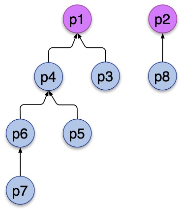

import Table from "/src/components/TableSQLite.astro";
import Slide from '/src/components/Slide.astro';

<Slide>

## L'auto-jointure

On qualifie de **cyclique** une structure de données qui fait directement ou non, référence à elle-même. On parle aussi de **relation récursive**.

On qualifie de **auto-jointure** une jointure d'une table avec elle-même.

Soit la relation `Personnes` suivante :

import {Content as TextDB} from '../../files/personnes-text.md'

<TextDB />

Cette relation est _cyclique_ car elle contient une colonne `responsable` qui fait référence à la clé primaire `numero` de la table `Personnes` elle-même.

Le rôle de cette colonne est de désigner le _responsable_ direct de chaque personne, s'il existe.

import {Content as Personnes} from '../../files/personnes-mermaid.md'

<Personnes />

<Table
  sqliteDB="public/sample/personnes.sqlite"
  title="Personnes"
  showSQL="true"
  query={`
SELECT * 
FROM Personnes
`}
/>

</Slide>
<Slide>

Graphiquement, on peut représenter la relation `Personnes` sous forme de graphe orienté :

</Slide>
<Slide>

La table `Personnes` permet de répondre à la question suivante : 

_Donner, pour chaque personne `S` (pour subordonné) ayant un responsable `R`, le `numero` et le `nom` de celui-ci :_

<Table
  sqliteDB="public/sample/personnes.sqlite"
  title="Personnes"
  showSQL="true"
  query={`
SELECT S.numero AS numeroS, R.numero AS numeroR, R.nom AS nomR
FROM Personnes S, Personnes R
WHERE S.responsable = R.numero;
`}
/>

Cette requête construit des **couples** de `Personnes`, la première étant la personne subordonnée `S` et la seconde son responsable `R`

Elle réalise donc une jointure de la table `Personnes` avec elle-même, ce qu'on appelle une **auto-jointure**

:::tip[Aide]
Il faut imaginer que la table `Personnes` est dupliquée en deux tables `S` et `R` qui sont ensuite jointes, comme si elles étaient deux tables distinctes.
:::

</Slide>
<Slide>

## Requêtes cycliques

_Donner pour chaque personne dont le nom est `Dupont`, son numéro ainsi que le numéro et le nom de son responsable s'il existe :_

<Table
  sqliteDB="public/sample/personnes.sqlite"
  title="Personnes"
  showSQL="true"
  query={`
SELECT S.numero AS numeroS, S.nom AS nomS, R.numero AS numeroR, R.nom AS nomR
FROM Personnes S, Personnes R 
WHERE S.responsable = R.numero AND S.nom = 'Dupont'
UNION
SELECT numero, nom, '__' , '__' 
FROM Personnes 
WHERE responsable IS NULL AND Nom = 'Dupont' ;
`}
/>

</Slide>
<Slide>

_Donner, pour chaque personne subordonnée à la personne de numéro  `p4` , son numéro et son nom. On ignorera les personnes qui n'ont pas de responsable._

<Table
  sqliteDB="public/sample/personnes.sqlite"
  title="Personnes"
  showSQL="true"
  query={`
SELECT SS.numero, SS.nom 
FROM Personnes R, Personnes S, Personnes SS 
WHERE R.numero = 'p4' 
AND R.numero = S.responsable 
AND S.numero = SS.responsable ;
`}
/>

Remarques :
  * Nous obtenons ici les subordonnées de niveau 2 en effectuant une double jointure
  * Il est impossible d'effectuer des jointures  _récursivement_
  * Cette requête montre que SQL ne permet pas d'obtenir facilement les responsables directs et indirects d'une personne déterminée sans recourir à la  _programmation procédurale_

</Slide>
<Slide>

## Un autre exemple

On modélise une nomenclature de `produits`.

Chaque produit est _composé_ de sous-produits, qui sont _eux-même composés_ de sous-produits, etc.

import { Content as ProduitsDB } from "/src/content/files/produits-text.md";

<ProduitsDB />

La table `COMPOSITION` représente les relations de composition entre produits

Une ligne `(h, b, q)` indique que le produit `b`  est un composant du produit `h`, et qu'il faut `q` unités de `b` pour fabriquer 1 unité de `h`

Les matières premières ont un prix et un poids unitaires fixés.

Le prix et le poids des autres produits peuvent être déterminés à partir des caractéristiques de leurs composants :

<Table
  sqliteDB="public/sample/produits.sqlite"
  title="Produits"
  query={`
SELECT *
FROM PRODUIT;
`}
/>
<Table
  sqliteDB="public/sample/produits.sqlite"
  title="Produits"
  query={`
SELECT *
FROM COMPOSITION;
`}
/>

</Slide>
<Slide>

_Donner les informations relatives aux produits p4 ainsi que sa composition :_

<Table
  sqliteDB="public/sample/produits.sqlite"
  title="Composition"
  showSQL="true"
  query={`
SELECT H.NPRO, H.LIBELLE , C.QTE, B.LIBELLE AS libelleB
FROM PRODUIT H, COMPOSITION C, PRODUIT B 
WHERE C.COMPOSE = H.NPRO 
AND C.COMPOSANT = B.NPRO 
AND H.NPRO = 'p4' ;

`}
/>

_Dans cette requête, `H` et `B` désigne respectivement le **produit composé** (haut) et le **produit composant** (bas)_

Encore une fois, on réalise une **auto-jointure** de la table `PRODUIT` pour obtenir les informations relatives à la composition du produit `p4`.

:::tip[Aide à la compréhension]
Il faut imaginer que la table `PRODUIT` est dupliquée en deux tables `H` et `B` qui sont ensuite jointes, comme si elles étaient deux tables distinctes.
:::

</Slide>
<Slide>

### Avec la syntaxe `JOIN`

<Table
  sqliteDB="public/sample/produits.sqlite"
  title="Produits"
  showSQL="true"
  query={`
  SELECT H.NPRO, H.LIBELLE , C.QTE, B.LIBELLE 
FROM PRODUIT H
JOIN COMPOSITION C
ON C.COMPOSE = H.NPRO 
JOIN PRODUIT B
ON C.COMPOSANT = B.NPRO
WHERE H.NPRO = 'p4' ;
`}
/>

</Slide>
<Slide>

Un autre exemple, plus complexe :

_Donner le prix et poids unitaires d’un produit fini ou semi-fini dont tous les composants ont un poids et un prix unitaires._

<Table
  sqliteDB="public/sample/produits.sqlite"
  title="Produits"
  showSQL="true"
  query={`
SELECT

    PH.NPRO,
    SUM(QTE*PB.PRIX_U),
    SUM(QTE*PB.POIDS_U)

FROM PRODUIT PH, COMPOSITION C, PRODUIT PB

WHERE 
    PH.NPRO = C.COMPOSE
    AND C.COMPOSANT = PB.NPRO
    AND NOT EXISTS (
        SELECT * 
        FROM COMPOSITION CC, PRODUIT BB
        WHERE 
            CC.COMPOSANT = BB.NPRO 
            AND CC.COMPOSE = PH.NPRO
            AND (BB.PRIX_U is null OR BB.POIDS_U is null)
        )
GROUP BY PH.NPRO
;
`}
/>

</Slide>
<Slide>

## Conclusion

* Les requêtes _cycliques_ ou _récursives_ sont des requêtes qui font référence d'une table à elle-même.
* Elles sont souvent utilisées pour modéliser des structures de données hiérarchiques ou des relations de composition.
* En SQL, il est possible de réaliser des requêtes _cycliques_ en effectuant des **auto-jointures** de tables.
* Les requêtes _récursives_ sont plus complexes à réaliser et nécessitent souvent de recourir à des procédures stockées ou à des langages de programmation.

</Slide>
