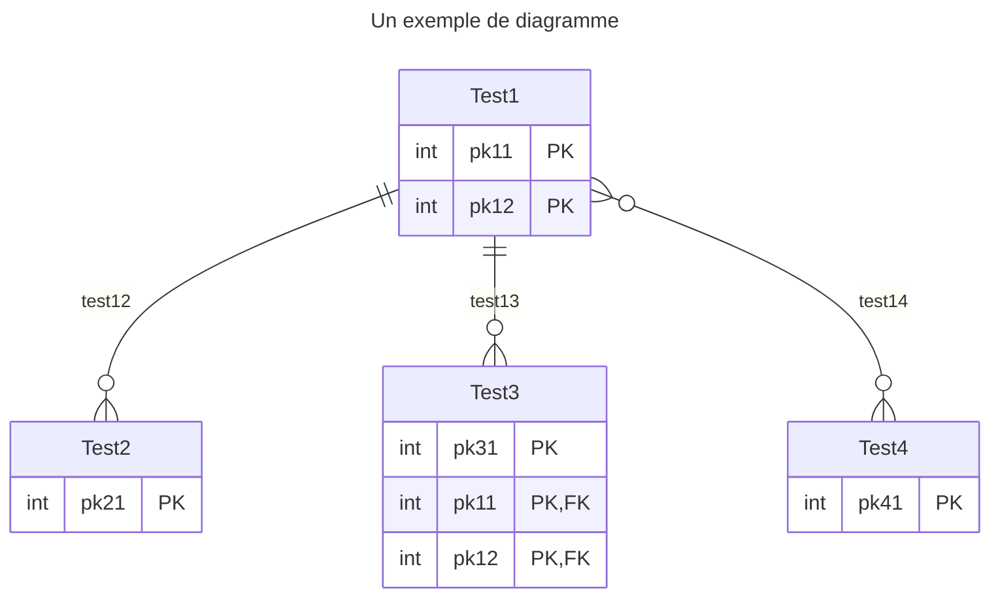

<!-- <iframe src="https://docs.google.com/presentation/d/e/2PACX-1vRAH6-YtNH7DKH6jk127wotWXtNwiCuG8v1Zs0jIhqQoqQOvyFnzcD-mvQeJd-Uiy8KyV6ZZpPbkweL/embed?start=false&loop=false&delayms=3000" frameborder="0" width="960" height="569" allowfullscreen="true" mozallowfullscreen="true" webkitallowfullscreen="true" style="min-height:488px"></iframe> -->

## Qu’est ce qu’une Base De Données (BDD) ?

- Une base de données est une **collection de données cohérentes** entre elles, généralement de taille importante
- Modélise des informations du monde réel
    - **Entités**, e.g., étudiants, cours, notes, etc.
    - **Associations**, e.g., Bob a choisi le cours de BDD
- Exemples de bases de données
    - Achats en ligne
    - Abonnement à un club de sport
    - Compte en banque
    - Réservation de billets de train
    - Etude à l’université
    - etc.
- Une **BDD informatique** doit être **interrogeable**

## Les défis des bases de données

## Qu’est ce qu’un SGBD ?

## Pourquoi un SGBD ?

## Intégrité et unicité des données

## Confidentialité et sûreté des traitements

## Indépendance des données

## Description des données

