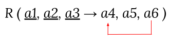

import Slide from "/src/components/Slide.astro";
import Table from "/src/components/Table.astro";

<Slide title="Résumé des concepts">

Dans le [premier chapitre du cours](/bdd/01-concepts/01-introduction/), nous avons abordé les concepts suivants :

- Les lignes, colonnes et cellules d'une table
- Les clés primaires et étrangères
- Le phénomène de redondance des données
- Les formes normales (1NF, 2NF, 3NF)
- La décomposition d'une table en plusieurs tables normalisées

</Slide>

<Slide>

## Lignes, colonnes et cellules

- Les lignes représentent les enregistrements
- Les colonnes représentent les attributs
- Les cellules contiennent les valeurs

</Slide>

<Slide>

## Clés primaires et étrangères

- La clé primaire identifie de manière unique chaque ligne d'une table
- La clé étrangère établit une relation entre deux tables

</Slide>

<Slide>

## Redondance des données

- La redondance des données est la répétition d'informations identiques dans une base de données
- Elle peut entraîner des anomalies et des incohérences

</Slide>

<Slide>

## Formes normales

:::tip[Définition]
Les formes normales sont des **règles** qui permettent de définir des **étapes de normalisation** pour **garantir l'intégrité** des données et éviter les anomalies
:::

</Slide>

<Slide>

### 1ère forme normale (1FN ou 1NF)

:::tip[Définition]
Une relation est dite de **première forme normale**, si et seulement si :
* elle admet **une clé** (ou un ensemble de clés)
* tout attribut contient une **valeur atomique**
* tous les attributs sont **non répétitifs**
* tous les attributs sont **constants dans le temps**
:::

#### Exemple de non-respect de la 1FN

<Table
    title="Produits"
    caption="Exemple de table non normalisée 1FN"
    headers={['IDProduit', 'Description', 'Fournisseurs']}
    rows={[
        ['1', 'Téléviseur', 'Sony, Sharp, LG'],
        ['2', 'Chaîne Hifi', 'Philips, Sony']
    ]}
/>

* La colonne _Fournisseurs_ est répétitive (elle contient plusieurs valeurs)
    * Il faudrait décomposer la colonne _Fournisseurs_ en une **table** _Fournisseur_

</Slide>

<Slide title="Formes normales">

### 2ème forme normale (2FN ou 2NF)

:::tip[Définition]
Une relation est en deuxième forme normale (2FN ou 2NF) ssi :
* Elle est en première forme normale
* Tout **attribut non clé** ne dépend pas d'une **partie de clé**
:::

Autrement dit, tous les attributs non-identifiants sont totalement dépendants fonctionnellement de la totalité de l'identifiant (et donc de la clé primaire au niveau tabulaire)

La 2NF garantit que chaque colonne dépend de la clé primaires#### Exemples de non-respect de la 2FN

##### Règle : Tout attribut non clé **ne dépend pas d'une partie de clé**

<Table
    title="DetailsCommandes"
    headers={['numeroCommande', 'numeroProduit', 'descriptionProduit']}
    rows={[
        ['1', '1', 'Téléviseur'],
        ['2', '2', 'Chaîne Hifi'],
        ['3', '1', 'Téléviseur']
    ]}
    caption="Exemple de table non normalisée 2FN"
/>

* Dans cet exemple :
    * L'identifiant de la table est _(numeroCommande, numeroProduit)_
    * On peut déduire qu'il existe une dépendance fonctionnelle entre _numeroProduit_ et _descriptionProduit_
        * **numeroProduit → descriptionProduit**
    * La table n'est pas en 2FN car _descriptionProduit_ dépend d'une partie de la clé

:::note[Pour régler ce problème il faudrait décomposer la table en deux tables distinctes]
 
* **Commande**(<u>numeroCommande, numeroProduit*</u>)
* **Produit**(<u>numeroProduit</u>, descriptionProduit)
:::

#### Schématique du non-respect de la 2FN

> Si un attribut ne fait pas partie de la clé, il ne doit pas dépendre fonctionnellement d'une partie de la clé

</Slide>

<Slide>

### 3ème forme normale (3FN ou 3NF)
:::tip[Définition]
Une relation est en troisième forme ssi :
* Elle est en deuxième forme normale
* Tout attribut n'appartenant pas à un identifiant ne dépend pas d'un attribut non identifiant
:::

</Slide>
<Slide>

#### Exemples de non-respect de la 3FN

<Table
    title="Commandes"
    headers={['numeroCommande', 'numeroClient', 'nomClient']}
    rows={[
        ['1', '1', 'Dupont'],
        ['2', '1', 'Dupont'],
        ['3', '2', 'Durand']
    ]}
    caption="Exemple de table non normalisée 3FN"
/>

* Dans cet exemple :
    * L'identifiant de la table est _numeroCommande_
    * On peut déduire qu'il existe une dépendance fonctionnelle entre _numeroClient_ et _nomClient_
        * **numeroClient → nomClient**
    * La table n'est pas en 3FN car _nomClient_ dépend d'un attribut non-clé ( _numeroClient_ ne fait pas partie de la clé)

:::note[Pour régler ce problème il faudrait décomposer la table en deux tables distinctes]
 
* **Commande**(<u>numeroCommande</u>, numeroClient*)
* **Client**(<u>numeroClient</u>, nomClient)
:::

</Slide>
<Slide>

#### Schématique du non-respect de la 3FN

> Si un attribut ne fait pas partie de la clé, il ne doit pas dépendre fonctionnellement d'un autre attribut non-clé

</Slide>

<Slide>

## Décomposition

- La décomposition consiste à diviser une table en plusieurs tables normalisées
- Elle permet d'éliminer la redondance des données et de prévenir les anomalies

* Soit une table `R` possédant 3 attributs `A`, `B` et `C`

* Il existe une dépendance fonctionnelle entre `B` et `C` (Si on connait `B`, alors on connait nécessairement `C`)
    * On doit donc **extraire la colonne `C`** de la table `R` pour éviter la redondance interne
    * La colonne **`B` doit être présente dans les 2 tables** pour pouvoir reconstruire l'information
    
* On peut aussi remarquer dans cet exemple que :
    * `B` sera une **clé étrangère** dans la table `R`
    * `B` sera une **clé primaire** dans la table `S`

> Il peut exister plusieurs dépendances fonctionnelles au sein d'une même table.   Il faudra alors décomposer autant de fois que nécessaire pour éviter la redondance.

</Slide>
