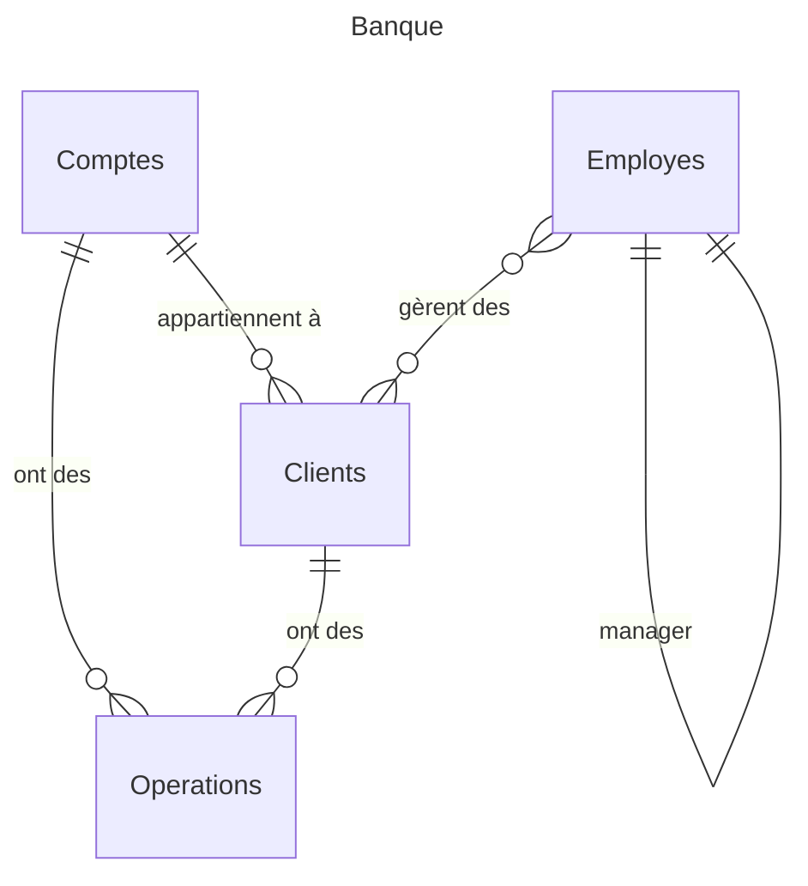

import Slide from '/src/components/Slide.astro';

<Slide>

Dans les grandes lignes, l'examen portera sur tous les concepts et les compétences abordés dans les cours de base de bases de données relationnelles et SQL.

## Format de l'examen

- **Durée** : 2 heures
- **Type** : Questions de cours et exercices pratiques
- **Supports autorisés** : 1 copie double (ou 2 feuilles volantes) **manuscrite** :
    - Pas de photocopies, ni de documents imprimés : Tout document non manuscrit sera considéré comme une **tentative de fraude**.
    - Pas de téléphone portable, de montre connectée, d'ordinateur, de tablette, de calculatrice programmable, de clé USB, etc.
- **Identification** : Vous devez être en possession de votre **carte d'étudiant** et d'une **pièce d'identité** valide pour pouvoir passer l'examen et me rendre votre travail

</Slide>
<Slide>

## Contenus types de l'examen :

- Questions de cours
- Normalisation (1NF, 2NF, 3NF) et décomposition
- Algèbre relationnelle
- Ecriture en langages SQL : DQL, DML, DDL, TCL
    - DQL : Requêtes simples, jointures, sous-requêtes, agrégation, groupement, tri
    - DML : Insertion, mise à jour, suppression
    - DDL : Création de tables, contraintes, vues, triggers, procédures stockéess
    - TCL : Transactions, jalons (savepoints)

</Slide>
<Slide>

## Exemples de questions de cours

1. Qu'est-ce que la normalisation des bases de données ? Quels sont les avantages de la normalisation ? Expliquez les trois premières formes normales (1NF, 2NF, 3NF).
2. Qu'est-ce que l'algèbre relationnelle ? Quels sont les opérateurs de l'algèbre relationnelle ?
3. Quelles sont les sous langages du SQL ? Quelles parties du SQL adressent-ils ?
4. Qu'est-ce qu'un déclencheur (trigger) en SQL ?
5. Qu'est-ce qu'une transaction en SQL ?
6. Qu'est-ce qu'une procédure stockée en SQL ?
7. Qu'est-ce qu'une vue en SQL ?
8. Que signifie l'acronyme ACID en base de données ? Expliquez chaque propriété.
9. Quelle fonction SQL permet de compter le nombre de lignes d'une table ?

</Slide>
<Slide>

## Exemple d'exercice de normalisation

Soit la relation `boutique` non normalisée suivante :

```ansi wrap frame="none"
boutique (numeroClient, nomClient, numeroCommande, dateCommande, quantiteDetail, numeroProduit, nomProduit, prixProduit)
```

Ainsi que les données suivantes :

import Table from '/src/components/Table.astro';

<Table
    title='Boutique'
    headers={['numeroClient', 'nomClient', 'numeroCommande', 'dateCommande', 'quantiteDetail', 'numeroProduit', 'nomProduit', 'prixProduit']}
    rows={[
        [1, 'Alice', 1, '2022-01-01', 2, 1, 'Pomme', 1.5],
        [1, 'Alice', 1, '2022-01-01', 3, 2, 'Poire', 2.0],
        [2, 'Bob', 2, '2022-01-02', 1, 1, 'Pomme', 1.5],
        [2, 'Bob', 2, '2022-01-02', 2, 2, 'Poire', 2.0],
    ]}
/>

Normaliser la relation `boutique` en 3ᵉ forme normale (3NF) en justifiant vox choix

<details>

<summary>Solution</summary>

En observant les données de la relation, on peut déduire que les dépendances fonctionnelles suivantes :

```
numeroClient -> nomClient
numeroCommande -> dateCommande
numeroCommande, numeroProduit -> quantiteDetail
numeroProduit -> nomProduit, prixProduit
```

Et que `numeroCommande, numeroProduit` est une clé candidate de la relation car il permet d'identifier de manière unique chaque ligne.

#### 1ère forme normale (1NF)

La relation `boutique` est en 1ᵉ forme normale (1NF) car elle contient des valeurs atomiques.

#### 2ème forme normale (2NF)

Rappel sur le non-respect de la 2ᵉ forme normale (2NF) :


> Si un attribut ne fait pas partie de la clé, il ne doit pas dépendre fonctionnellement d'une partie de la clé

La relation `boutique` n'est donc pas en 2ᵉ forme normale (2NF) car :

- `nomProduit`et `prixProduit` ne dépendent pas de la clé candidate `numeroCommande, numeroProduit` mais de `numeroProduit` uniquement
- `dateCommande` ne dépend pas de la clé candidate `numeroCommande, numeroProduit` mais de `numeroCommande` uniquement

#### 3ème forme normale (3NF)

Rappel sur le non-respect de la 3ᵉ forme normale (3NF) :


> Si un attribut ne fait pas partie de la clé, il ne doit pas dépendre fonctionnellement d'un autre attribut non-clé

La table `boutique` n'est pas en 3ᵉ forme normale (3NF) car :

- `nomClient` dépend d’un attribut non-clé `numeroClient`

#### Décomposition

La table `boutique` doit donc être décomposée en plusieurs relations pour respecter la 3ᵉ forme normale (3NF) :

```ansi frame="none"
Clients (numeroClient, nomClient)
Commandes (numeroCommande, dateCommande, numeroClient*)
DetailsCommandes (numeroCommande*, numeroProduit*, quantiteDetail)
Produits (numeroProduit, nomProduit, prixProduit)
```

</details>

</Slide>
<Slide>

## Exemple d'exercices d'algèbre relationnelle et de SQL

Soit la base de données `Banque` suivante :

#### Format textuel : 

```ansi frame="none"
Comptes (id, solde, id_client*)
Clients (id, nom, prenom, id_employe*)
Employes (id, nom, prenom, id_manager*)
Employes_Clients (id_client* id_employe*,)
Operations (id, id_compte, montant, date, type)
```

#### Diagramme entité-association :



#### Exemple de données :

<div class="tables-2-col">

<Table
    title='Comptes'
    headers={['id', 'solde', 'id_client']}
    rows={[
        [1, 1000, 1],
        [2, 2000, 2],
        [3, 10000, 2],
    ]}
/>

<Table
    title='Clients'
    headers={['id', 'nom', 'prenom']}
    rows={[
        [1, 'Alice', 'Dupont'],
        [2, 'Bob', 'Martin'],
        [3, 'Lucie', 'Olivier'],
    ]}
/>

<Table
    title='Employes'
    headers={['id', 'nom', 'prenom', 'id_manager']}
    rows={[
        [1, 'Charlie', 'Durand', 2],
        [2, 'David', 'Lefevre', 'NULL'],
        [3, 'Eva', 'Girard', 2],
    ]}
/>

<Table
    title='Employes_Clients'
    headers={['id_client', 'id_employe']}
    rows={[
        [1, 1],
        [2, 1],
        [2, 2],
    ]}
/>

<Table
    title='Operations'
    headers={['id', 'id_compte', 'montant', 'date', 'type']}
    rows={[
        [1, 1, 100, '2022-01-01', 'Dépôt'],
        [2, 1, 50, '2022-01-02', 'Retrait'],
        [3, 2, 200, '2022-01-03', 'Dépôt'],
        [4, 3, 1000, '2022-01-04', 'Dépôt'],
    ]}
/>

</div>

</Slide>
<Slide>

### Algèbre relationnelle

Écrire les requêtes algébriques suivantes :

1. Afficher le nom, prénom et le solde de chaque compte de chaque client.
2. Afficher les clients gérés par l'employé "Charlie Durand".
3. Afficher les employés qui ne gèrent aucun client.
4. Afficher les clients qui n'ont pas de compte.
5. Afficher les clients qui ont effectué des opérations de type "Dépôt".
6. Afficher les employés qui gèrent tous les clients

</Slide>
<Slide>

### SQL

#### Exercice de conversion d'algèbre relationnelle en SQL

Écrire les requêtes SQL correspondantes aux requêtes algébriques précédentes.

#### Exercice de création de vues, triggers et procédures stockées

1. Écrire le code SQL pour créer une vue nommée `VueComptesClients` qui affiche le nom, prénom et le solde de chaque compte de chaque client.
2. Écrire une requête SQL pour afficher le contenu de la vue `VueComptesClients`.
3. Écrire un trigger SQL qui met à jour le solde du compte après chaque opération de type "Dépôt" ou "Retrait".
4. Écrire une procédure stockée SQL qui affiche le solde d'un compte donné.

#### Exercice de DDL et TCL

1. Écrire le code SQL pour créer une table nommée `ComptesArchives` qui contient les comptes archivés.
2. Écrire une requête SQL pour insérer tous les comptes dans la table `ComptesArchives` depuis un `SELECT` sur la table `Comptes`.
3. Écrire une requête SQL pour supprimer tous les comptes archivés de la table `ComptesArchives`.

</Slide>
<Slide>

## Conclusion

- L'examen portera sur tous les concepts et les compétences abordés dans les cours de base de bases de données relationnelles et SQL.
- Les supports autorisés sont limités à 1 copie double (ou 2 feuilles volantes) manuscrite.
- Vous devez être en possession de votre carte d'étudiant et d'une pièce d'identité valide pour pouvoir passer l'examen et me rendre votre travail.
- Les exercices d'examen seront similaires à ceux abordés dans les TD et les TP.
- Les exercices présentés ici ne sont que des exemples et seront adaptés pour la durée de l'examen.
- La note de l'examen comptera pour une partie importante de votre note finale : 60% contre 40% pour le TP noté.
- Si vous avez travaillé régulièrement en TD et en TP, vous devriez réussir l'examen !

</Slide>
