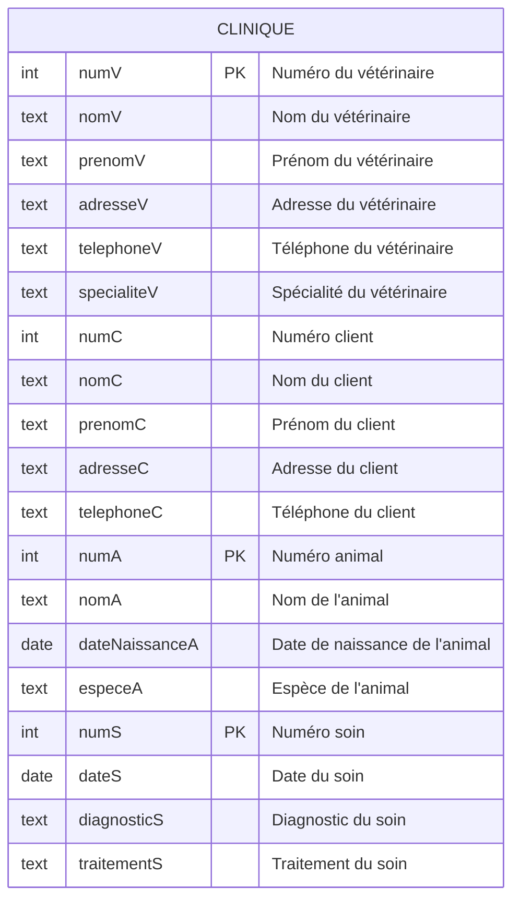

## Objectifs

Le but de ce projet est de revoir tous les concepts vus en cours, TDs et TPs depuis le début du module :

- Normalisation
- Algèbre relationnelle
- Requêtes SQL (sous-requêtes, jointures, agrégats)
- Transactions
- Triggers, procédures stockées et vues

## Énoncé

On souhaite concevoir une base de données pour une clinique vétérinaire.

La clinique vétérinaire est une entreprise qui propose des `soins` pour les `animaux` domestiques. Elle est composée de plusieurs `vétérinaires`, chacun ayant un _numéro_ d'identification unique, un _nom_, un _prénom_, une _adresse_, un numéro de _téléphone_ et une _spécialité_ (chien, chat, oiseau, etc.).

Les `clients` de la clinique sont également identifiés par un _numéro_ d'identification unique, un _nom_, un _prénom_, une _adresse_ et un numéro de _téléphone_.

Les `animaux` soignés à la clinique sont identifiés par un _numéro_ d'identification unique, un _nom_, une _espèce_ (chien, chat, oiseau) et appartiennent à un _propriétaire_ (un `client`)

Les `soins` prodigués à un animal sont identifiés par un _numéro_ d'identification unique, une _date_, un `vétérinaire`, un `animal`, un _diagnostic_ et un _traitement_.

## Schéma proposé

Le stagiaire en informatique qui a recueilli les besoins du client vous propose le schéma relationnel suivant :

```ansi wrap frame="none"
CLINIQUE ( numV, nomV, prenomV, adresseV, telephoneV, specialiteV, numC, nomC, prenomC, adresseC, telephoneC, numA, nomA, dateNaissanceA, especeA, numS, dateS, diagnosticS, traitementS )
```

Informations complémentaires :



Code SQL de création de la table `CLINIQUE` :

```sql
CREATE TABLE CLINIQUE (
    numV INT,
    nomV TEXT,
    prenomV TEXT,
    adresseV TEXT,
    telephoneV TEXT,
    specialiteV TEXT,
    numC INT,
    nomC TEXT,
    prenomC TEXT,
    adresseC TEXT,
    telephoneC TEXT,
    numA INT,
    nomA TEXT,
    dateNaissanceA DATE,
    especeA TEXT,
    numS INT,
    dateS DATE,
    diagnosticS TEXT,
    traitementS TEXT,
    PRIMARY KEY (numV, numA, numS),
);
```

## 1. Normalisation

_Barème : 5 points_

:::note[Rappel]
La normalisation consiste à organiser les données d'une base de données relationnelle en tables pour éviter la redondance et les anomalies de mise à jour.
:::

##### 1. Identifiez les dépendances fonctionnelles de ce schéma
##### 2. Est-ce que le schéma proposé est en 2NF ? en 3NF ? Justifiez vos réponses
##### 3. Proposez une décomposition en 3NF de cette relation

_Votre schéma textuel en 3NF doit préciser les clés primaires et étrangères de chaque table._

:::tip[Rendu]
Sauvegardez vos DF, justifications et décomposition 3NF dans un fichier texte nommé : 

`1-clinique-normalisation.md`
:::

_Les fichiers avec l'extension .md sont des fichiers de texte simple au format **Markdown**. Vous pouvez les éditer avec un éditeur de texte comme Visual Studio Code ou Notepad++. Vous pouvez aussi télécharger/exporter des documents Google Docs ou Office directement au format MarkDown_

## 2. SQL DDL

_Barème : 5 points_

:::note[Rappel]
Le DDL (Data Definition Language) est un sous-langage de SQL permettant de définir la structure des données dans une base de données relationnelle.
:::

##### 1. Téléchargez la base de données [clinique-non-normalisee.sqlite](/bdd/clinique/clinique-non-normalisee.sqlite)

   _Cette base de données contient une seule table de données non normalisée `CLINIQUE`_

##### 2. Renommez le fichier téléchargé en `clinique.sqlite`, puis ouvrez-le dans SQLiteStudio ou un autre outil de votre choix

##### 3. Rédigez le code SQL pour créer les tables normalisées que vous avez proposées dans la partie 1 :

   - Pensez à définir les clés primaires et étrangères
   - Utilisez des types de données appropriés pour chaque colonne
   - Définissez les contraintes statiques (_NOT NULL_, _UNIQUE_, _CHECK_, _DEFAULT_) si vous le jugez nécessaire
   - Définissez le comportement de suppression des clés étrangères en cas de suppression d'une ligne parente (_CASCADE_, _SET NULL_, _SET DEFAULT_, _NO ACTION_)

##### 4. Proposez les requêtes SQL pour insérer les données dans ces tables en utilisant des [requêtes INSERT depuis un SELECT](/bdd/07-sql3/02-sql-dml/#depuis-un-select)

:::tip[Rendu]
Sauvegardez votre code SQL DDL de création des tables et d'insertion des données dans un fichier texte nommé : 

`2-clinique-ddl.sql`
:::

_L'extension de fichier .sql est utilisée pour préciser les fichiers de script SQL, mais ce sont des fichiers de texte simple que vous pouvez éditer avec un éditeur de texte comme Visual Studio Code ou Notepad++_

## 3. Requêtes

### 3.1. Algèbre relationnelle

_Barème : 5 points_

Proposez l'algèbre relationnelle pour les requêtes suivantes :

##### 1. Afficher les `noms` et `prénoms` des `vétérinaires`
##### 2. Afficher le `nom` des `animaux` ainsi que le `nom` et `prénom` de leur `propriétaire`
##### 3. Afficher les noms des `animaux` soignés par le `vétérinaire` numéro `1`, ainsi que les informations du `vétérinaire` et du `soin` prodigué
##### 4. Afficher les `animaux` qui ont `plus de 5 ans`
##### 5. Afficher les `noms` et `prénoms` des `vétérinaires` qui ont soigné `tous les animaux`

:::tip[Rendu]
Sauvegardez vos requêtes d'algèbre relationnelle dans un fichier texte nommé :

 `3-1-clinique-algebre.md`
:::

### 3.2. Requêtes SQL

_Barème : 5 points_

Proposez les requêtes SQL pour les requêtes suivantes :

##### 1. Afficher les `noms` et `prénoms` des `vétérinaires`
##### 2. Afficher le `nom` des `animaux` ainsi que le `nom` et `prénom` de leur `propriétaire`
##### 3. Afficher les `animaux` `soignés` par le `vétérinaire` numéro `1`, ainsi que les informations du `vétérinaire` et du `soin` prodigué
##### 4. Afficher les `animaux` qui ont `plus de 5 ans`
##### 5. Afficher les `noms` et `prénoms` des vétérinaires qui ont soigné `tous les animaux`
##### 6. Afficher le `nombre` d'animaux soignés par chaque `vétérinaire`
##### 7. Afficher les `clients` qui ont plus de `1` animal
##### 8. Afficher le `nombre` de soins effectués pour chaque `animal`
##### 9. Afficher le `nombre` d'animaux par `espèce`
##### 10. Afficher les vétérinaires qui ont soigné au moins un `chien` et un `chat`

:::tip[Rendu]
Sauvegardez vos requêtes SQL dans un fichier texte nommé :

`3-2-clinique-dql.sql`
:::

## 4. SQL DML

_Barème : 5 points_

Proposez des requêtes SQL pour les actions suivantes :

##### 1. Ajouter un nouveau vétérinaire
##### 2. Ajouter un nouveau client
##### 3. Ajouter un nouvel animal pour le client précédemment ajouté
##### 4. Ajouter un nouveau soin pour le vétérineaire et l'animal précédemment ajouté

_Attention, pour chaque ajout, vous deverez retrouver les numéros d'identification des éléments précédemment ajoutés avec des requêtes SELECT (par exemple en recherchant par _nom_ et _prénom_ ), pas en utilisant directement des identifiants._

##### 5. Modifier le nom du vétérinaire numéro 1
##### 6. Supprimer le client numéro 1. _Tous les animaux et soins associés à ce client doivent également être supprimés automatiquement grâce à votre configuration du comportement en cascade._

:::tip[Rendu]
Sauvegardez votre transaction SQL dans un fichier texte nommé :

 `4-clinique-dml.sql`
:::

## 5. Evolution du schéma

_Barème : 3 points_

Le client souhaite ajouter une nouvelle table `FACTURES` pour gérer les factures des clients. Cette table doit contenir les informations suivantes :

- `numF` : numéro de la facture (clé primaire)
- `numS` : numéro du soin (clé étrangère)
- `dateF` : date de la facture
- `montantF` : montant de la facture
- `payeeF` : indique si la facture a été payée ou non

##### Proposez le code SQL pour créer cette nouvelle table et les contraintes nécessaires.

:::tip[Rendu]
Sauvegardez votre code SQL de création de la table `FACTURE` dans un fichier texte nommé :

`5-clinique-evolution.sql`
:::

## 6. Triggers, procédures stockées et vues

_Barème : 12 points_

Rédigez le code SQL pour les actions suivantes :

##### 1. Une vue qui permet d'afficher les animaux soignés par le vétérinaire numéro 1

##### 2. Une procédure stockée qui permet de générer une ligne de facture pour tous les soins qui n'ont pas encore été facturés :

    - La date de la facture est la date du soin
    - Le montant de la facture est de 50€
    - La facture est marquée comme non payée
    - La facture ne doit pas être générée si une ligne de facture existe déjà pour ce soin

<details>
<summary>_SQLite ne supportant pas directement les procédures stockées, vous pouvez :_</summary>

- Soit proposer le code SQL pour une procédure stockée dans un autre SGBD (MySQL, PostgreSQL, SQL Server, Oracle, etc.)
    - Par exemple, vous pouvez directement importer l'[export de la clinique non normalisée](/bdd/public/clinique/clinique-non-normalisee-sqlite-EXPORT.sql) dans [MySQL](https://dev.mysql.com/downloads/installer/), puis executer vos requêtes DDL pour créer les tables normalisées
- Soit proposer le code SQL pour une transaction qui effectue la même opération
- Soit proposer une fonction qui effectue la même opération dans un langage de programmation (PHP, Javascript, Python, Java, C#, etc.)

</details>

##### 3. Un trigger qui permet de mettre à jour le montant de la facture à 1000€ si le traitement du soin contient le mot "chirurgie"

_Dans SQLiteStudio, vous pouvez ajouter des triggers dans l'onglet "Triggers" des tables.
Lorsque vous ajoutez un trigger dans SQLiteStudio, vous n'avez pas besoin de changer le DELIMITER._

Pour tester le trigger, vous pouvez ajouter un soin avec le traitement contenant le mot "chirurgie", relancer votre procédure précédente pour générer les factures, puis vérifier que le montant de la facture est bien de 1000€.

Pensez à inclure vos requêtes de test dans le fichier de rendu.

:::tip[Rendu]
Sauvegardez votre code SQL dans un fichier texte nommé :

`6-clinique-triggers.sql`
:::
