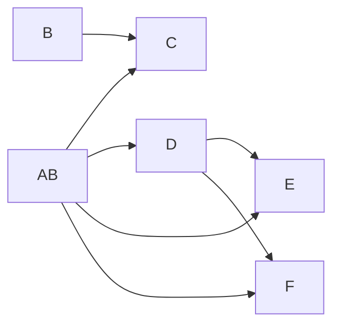
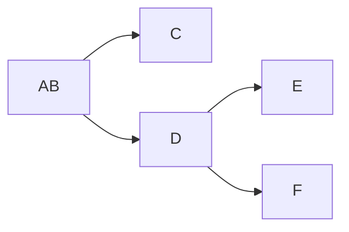
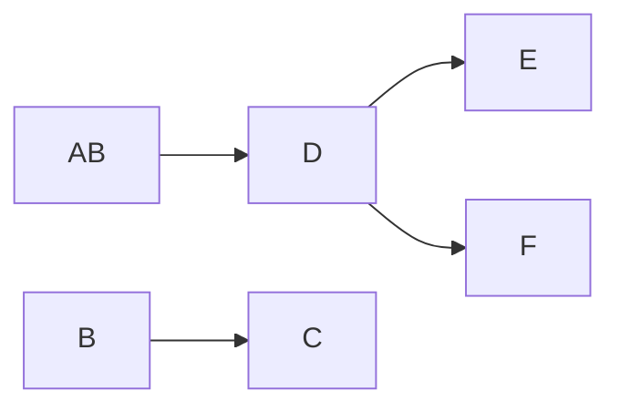

import { Tabs, TabItem } from '@astrojs/starlight/components';

<Tabs>
  <TabItem label="Énoncé">
    Soit une relation R1 de schéma :
    
    ```
    R1 (A, B, C, D, E, F) 
    ```

    Avec l'ensemble de dépendances suivant :

    ```
    { 
      AB → C, 
      AB → D,
      AB → E,
      AB → F,
      B → C,
      D → E,
      D → F 
    }
    ```

    1. **Quelle est la couverture minimale de dépendances ? Déssinez son graphe.**
    
    2. **Quelles est la clé de R1 ?**

  </TabItem>
  <TabItem label="Solution">
  
  
    Soit une relation R1 de schéma :
    
    ```
    R1 (A, B, C, D, E, F) 
    ```

  1. **Quelle est la couverture minimale de dépendances ?**

  L'ensemble des dépendances est :

    ```
    { 
      AB → C
      AB → D
      AB → E
      AB → F
      B → C
      D → E
      D → F
    }
    ```

Par défaut, on peut dessiner le graphe suivant : 



Par transitivité, on peut : 

* supprimer `AB → E` et `AB → F`, car `AB → D` et `D → EF` :
* Supprimer `B → C` car `AB → C` et `B → C` :




L'ensemble minimum de dépendances fonctionnelles de R1 est donc :

  ```
  { AB → C, AB → D, D → E, D → F }
  ```

Solution alternative :

Par transitivité, on peut : 

* supprimer `AB → E` et `AB → F`, car `AB → D` et `D → EF` :
* Supprimer `AB → C` car `B → C`:




L'ensemble minimum de dépendances fonctionnelles de R1 est donc :

  ```
  { AB → C, AB → D, D → E, D → F }
  ou
  { AB → D, B → C, D → E, D → F }
  ```

    
    2. **Quelles est la clé de R1 ?**

    La clé de cette relation est (A,B) car on observe que les attributs A et B déterminent tous les autres attributs de la relation

  </TabItem>
</Tabs>
