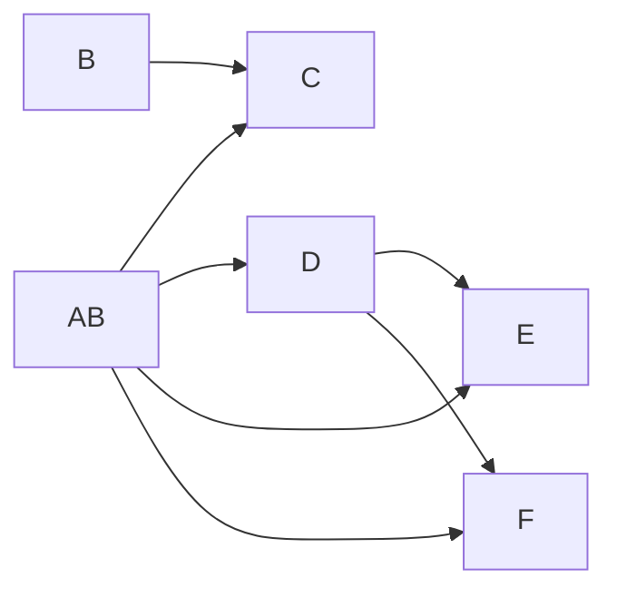
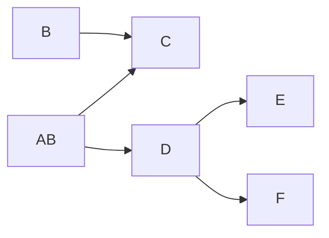

import { Tabs, TabItem } from '@astrojs/starlight/components';

<Tabs>


  <TabItem label="Énoncé">
    Soit une relation R1 de schéma :
    
    ```
    R1 (A, B, C, D, E, F) 
    ```

    Avec l'ensemble de dépendances suivant :

    ```
    { 
      AB → C
      AB → D
      AB → E
      AB → F
      B → C
      D → E
      D → F
    }
    ```

    1. **Quelle est la couverture minimale de dépendances ? Déssinez son graphe.**
    
    2. **Quelles est la clé de R1 ?**

    3. **Quelle est la forme normale de R1 ?**

    4. **On décompose la relation R1 en R11 et R12 :**

    ```
    R11(A, B, D, E, F) 
    ```
    et 
    ```
    R12(B,C)
    ```
    
   **Quelles sont les formes normales des relations R11 et R12 ?**

    5. **Proposer une décomposition sans perte d'information de R11.**

  </TabItem>
  
  <TabItem label="Solution">
  
    Soit une relation R1 de schéma :
    
    ```
    R1 (A, B, C, D, E, F) 
    ```

  1. **Quelle est la couverture minimale de dépendances ?**

  L'ensemble des dépendances est :

    ```
    { 
      AB → C
      AB → D
      AB → E
      AB → F
      B → C
      D → E
      D → F
    }
    ```

Par défaut, on peut dessiner le graphe suivant : 



Par transitivité, on peut supprimer `AB → E` et `AB → F`, car `AB → D` et `D → EF` :




L'ensemble minimum de dépendances fonctionnelles de R1 est donc :

  ```
  { AB → C, AB → D, B → C, D → E, D → F }
  ```
    
    2. **Quelles est la clé de R1 ?**

    La clé `AB` est la seule clé candidate car on observe que les attributs `A` et `B` déterminent tous les autres attributs de la relation

    3. **Quelle est la forme normale de R1 ?**

    Cette relation est en première forme normale mais :
    
      * pas en 2FN car il y a un attribut qui ne fait pas partie de la clé `C` qui dépend d'une partie de la clé `B`
      * pas en 3FN car il y a une dépendance transitive `D → E` et `D → F`

    4. **On décompose la relation R1 en R11 et R12 :**
    
    La relation R11 est en deuxième forme normale et pas en troisième normale car il subsiste une dépendance transitive. La relation R12 est en BCNF.

    5. **Proposer une décomposition sans perte d'information de R11.**
    
    On peut décomposer R11 en `R112(D, E, F)` et `R112(A,B,D)` sans perte d'information.

  </TabItem>
</Tabs>
