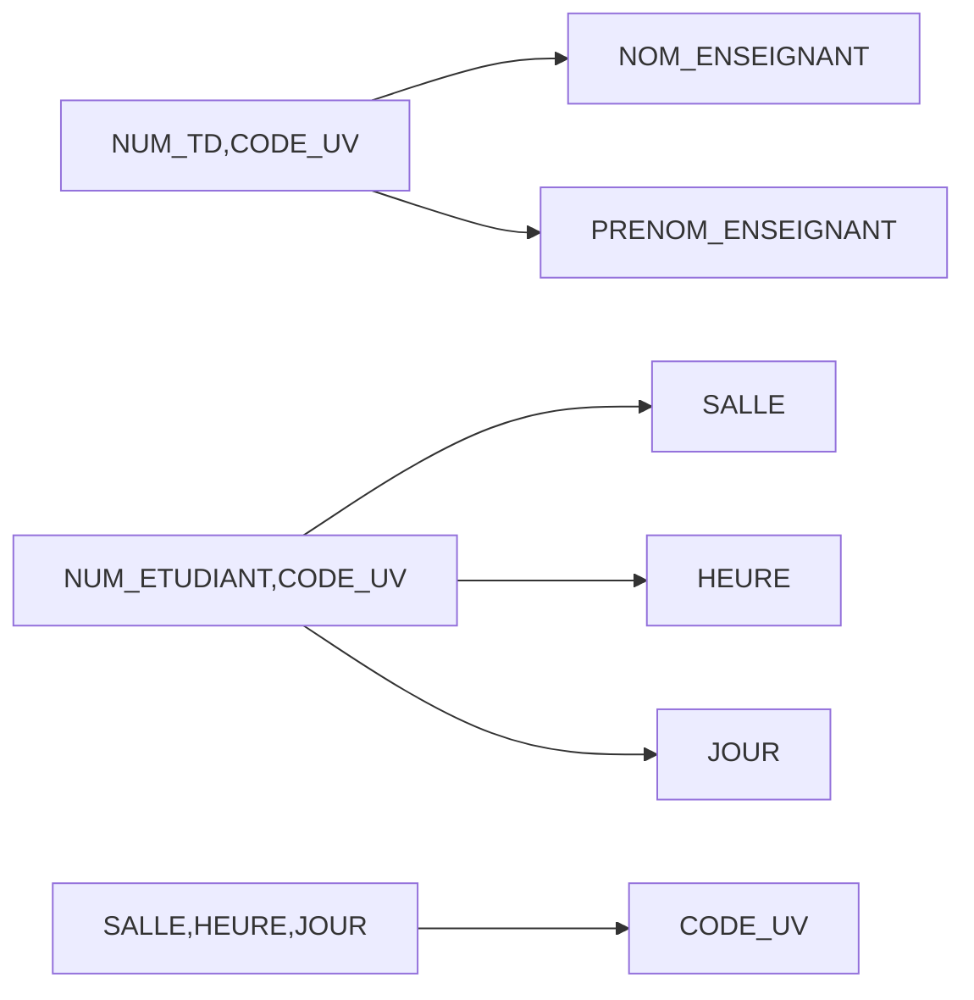

import { Code } from '@astrojs/starlight/components';

Soit le schéma suivant :

<Code code="ENSEIGNEMENT (NUM_TD, SALLE, JOUR, HEURE, NUM_ENSEIGNANT, NOM_ENSEIGNANT, PRENOM_ENSEIGNANT, CODE_UV, NOM_UV, NUM_ETUDIANT, NOM_ETUDIANT, PRENOM_ETUDIANT, ADRESSE_ETUDIANT, DATE_INSCRIPTION)" wrap="true" />


Les étudiants inscrits dans une UV (_CODE_UV_) sont répartis en groupe de TD (_NUM_TD_). La date d'inscription porte sur un étudiant dans une UV. Cette inscription l'affecte dans un groupe de TD.

Les hypothèses sont les suivantes :

* Un enseignant peut assurer l'encadrement de plusieurs groupes
* Un seul groupe de TD par salle à la même heure le même jour
* Un étudiant peut être inscrit dans plusieurs UV mais à un seul groupe de TD par UV
* Un enseignement d'une UV pour un groupe de TD a toujours lieu le même jour et dans la même salle à la même heure
* Un seul TD par semaine par UV

##### Questions :

1. **A l'aide d'exemples, montrer quelles anomalies et redondances sont impliquées par ce schéma**

    1. **Redondance** : Les salle et heure de TD figurent autant de fois que d'étudiants inscrits à ce groupe.
    2. **Incohérence possible** : Une mise à jour de l'heure d'un TD pourrait laisser la relation dans un état incohérent du fait de la redondance.
    3. **Anomalies d'insertion** : Il est impossible d'inscrire des étudiants si on ne connaît pas exactement les salles, heures et enseignants des TD (à moins d'introduire les valeurs nulles).
    4. **Anomalies de suppression** : Si l'on détruit le dernier étudiant d'un TD, on détruit en même temps les autres informations NUM_td, salle, heures, enseignants, …

2. **Donner une couverture minimale des dépendances fonctionnelles, ainsi que sa fermeture transitive**

:::note[Rappel]
La couverture minimale d'un ensemble de DFE est un sous-ensemble minimum des DFE permettant de générer toutes les autres DFE.
Synonymes : Famille génératrice
:::

**Couverture minimale** des dépendances fonctionnelles :

```
CODE_UV → NOM_UV
NUM_ETUDIANT → NOM_ETUDIANT
NUM_ETUDIANT → PRENOM_ETUDIANT
NUM_ETUDIANT → ADRESSE_ETUDIANT
NUM_ENSEIGNANT → NOM_ENSEIGNANT
NUM_ENSEIGNANT → PRENOM_ENSEIGNANT
NUM_TD, CODE_UV → NUM_ENSEIGNANT
NUM_ETUDIANT, CODE_UV → NUM_TD
NUM_ETUDIANT, CODE_UV → DATE_INSCRIPTION
NUM_TD, CODE_UV → SALLE
NUM_TD, CODE_UV → HEURE
NUM_TD, CODE_UV → JOUR
SALLE, HEURE, JOUR → NUM_TD
SALLE, HEURE, JOUR → CODE_UV
```

**Fermeture transitive** des dépendances fonctionnelles :

* A partir de `NUM_TD, CODE_UV → NUM_ENSEIGNANT` et `NUM_ENSEIGNANT → NOM_ENSEIGNANT`, on obtient : `NUM_TD, CODE_UV → NOM_ENSEIGNANT`
* A partir de `NUM_TD, CODE_UV → NUM_ENSEIGNANT` et `NUM_ENSEIGNANT → PRENOM_ENSEIGNANT`, on obtient : `NUM_TD, CODE_UV → PRENOM_ENSEIGNANT`
* A partir de `NUM_ETUDIANT, CODE_UV → NUM_TD` et `NUM_TD, CODE_UV → SALLE`, on obtient : `NUM_ETUDIANT, CODE_UV → SALLE`
* A partir de `NUM_ETUDIANT, CODE_UV → NUM_TD` et `NUM_TD, CODE_UV → HEURE`, on obtient : `NUM_ETUDIANT, CODE_UV → HEURE`
* A partir de `NUM_ETUDIANT, CODE_UV → NUM_TD` et `NUM_TD, CODE_UV → JOUR`, on obtient : `NUM_ETUDIANT, CODE_UV → JOUR`
* A partir de `SALLE, HEURE, JOUR → NUM_TD` et `NUM_TD → CODE_UV`, on obtient : `SALLE, HEURE, JOUR → CODE_UV`



3. **Soit la décomposition suivante :**


<Code code="ENSEIGNEMENT (NUM_TD, CODE_UV, HEURE, SALLE, JOUR, NUM_ENSEIGNANT, NOM_ENSEIGNANT, PRENOM_ENSEIGNANT)" wrap="true" />

<Code code="INSCRIPTION (NUM_ETUDIANT, NOM_ETUDIANT, PRENOM_ETUDIANT, ADRESSE_ETUDIANT, CODE_UV, NOM_UV, DATE_INSCRIPTION, NUM_TD)" wrap="true" />

    * a. Quelles sont les clés de ces relations ? Montrez que cette décomposition est sans perte et qu'elle préserve les dépendances fonctionnelles. 

**Clés** : 

* `(NUM_TD, CODE_UV)` pour `ENSEIGNEMENT`
* `(NUM_ETUDIANT, CODE_UV)` pour `INSCRIPTION`

**Sans perte** :

Car on retrouve les tuples de la relation initiale, en effectuant une jointure sur `(Code UV, NUM_TD) `

**Dépendances conservées** : En faisant l'union des DF de "ENSEIGNEMENT" et "INSCRIPTION", on retrouve la couverture minimale des DF, leurs fermetures sont donc les mêmes.

    * b. Existe-t-il encore des risques d'anomalies ou des redondances ?

**Redondance** : A chaque inscription d'un étudiant il y a répétition du nom du module.

    * c. Les relations sont-elles en 2ème forme normale ?

**2ème forme normale** : La première relation est bien en 2ème forme normale, la deuxième n'y est pas car par exemple _NOM_ETUDIANT_ ne dépend que d'une partie de la clé : _NUM_ETUDIANT_.

4. **Soit la décomposition suivante :**

<Code code="ENSEIGNEMENT (NUM_TD, CODE_UV, HEURE, SALLE, JOUR, NUM_ENSEIGNANT, NOM_ENSEIGNANT, PRENOM_ENSEIGNANT)" wrap="true" />
<Code code="ETUDIANT (NUM_ETUDIANT, NOM_ETUDIANT, PRENOM_ETUDIANT, ADRESSE_ETUDIANT)" wrap="true" />
<Code code="INSCRIPTION (NUM_ETUDIANT, CODE_UV, DATE_INSCRIPTION, NUM_TD)" wrap="true" />
<Code code="UV (CODE_UV, NOM_UV)" wrap="true" />
* 
  * a. Quelles sont les clés de ces relations ? Montrez que cette décomposition est sans perte et qu'elle préserve les dépendances fonctionnelles. 
  * b. Existe-t-il encore des risques d'anomalies ou des redondances ? 
  * c. Les relations sont-elles en 2ème forme normale ?

**Clés** : 

* `(NUM_TD, CODE_UV)` pour `ENSEIGNEMENT`
* `(NUM_ETUDIANT)` pour `ETUDIANT`
* `(NUM_ETUDIANT, CODE_UV)` pour `INSCRIPTION`
* `CODE_UV` pour `UV`

**Sans perte** :

On retrouve la relation "INSCRIPTION" de la question 3 en effectuant deux jointures :

- une sur `NUM_ETUDIANT`, entre `ETUDIANT` et `INSCRIPTION`
- l'autre sur `CODE_UV` entre le résultat de la précédente et `UV`

**Dépendances conservées** :

De la même manière que précédemment, en faisant l'union de ces DF on retrouve la couverture minimale de la relation `INSCRIPTION` précédente, et donc cette décomposition conserve les dépendances fonctionnelles.

**Redondances** : 

Dans `ENSEIGNEMENT` les nom de l'enseignant est répété plusieurs fois.

**2ème forme normale** : Les quatre relations sont en 2ème forme normale, car aucun attribut ne dépend
que d'un sous ensemble d'une clé.


5. **Les relations sont-elles en 3ème forme normale ?**

Si ce n'est pas le cas, proposez une nouvelle décomposition (sans perte et conservant les dépendances fonctionnelles).

La relation `ENSEIGNEMENT` n'est pas en troisième forme normale.

En effet, l'attribut `NOM_ENSEIGNANT` dépend de `NUM_ENSEIGNANT` qui n'est pas un attribut clé.

Une décomposition possible est :

<Code code="ENSEIGNANT (NUM_ENSEIGNANT, NOM_ENSEIGNANT, PRENOM_ENSEIGNANT)" wrap="true" />
<Code code="TD (NUM_TD, Code UV, HEURE, SALLE, JOUR, NUM_ENSEIGNANT)" wrap="true" />

Elle est sans perte, on retrouve la relation initiale en effectuant une jointure sur `NUM_ENSEIGNANT`.

**Dépendances fonctionnelles conservées** : En faisant l'union des DF, on retrouve celles de "ENSEIGNEMENT" de la question précédente. Leurs fermetures sont donc identiques.

**3eme forme normale** : La relation TD est bien en 3ème forme normale, car NUM_TD et Code UV dépendent effectivement d'attributs non clés, mais font eux-même partie d'une clé (voir définition de la 3eme forme normale).
