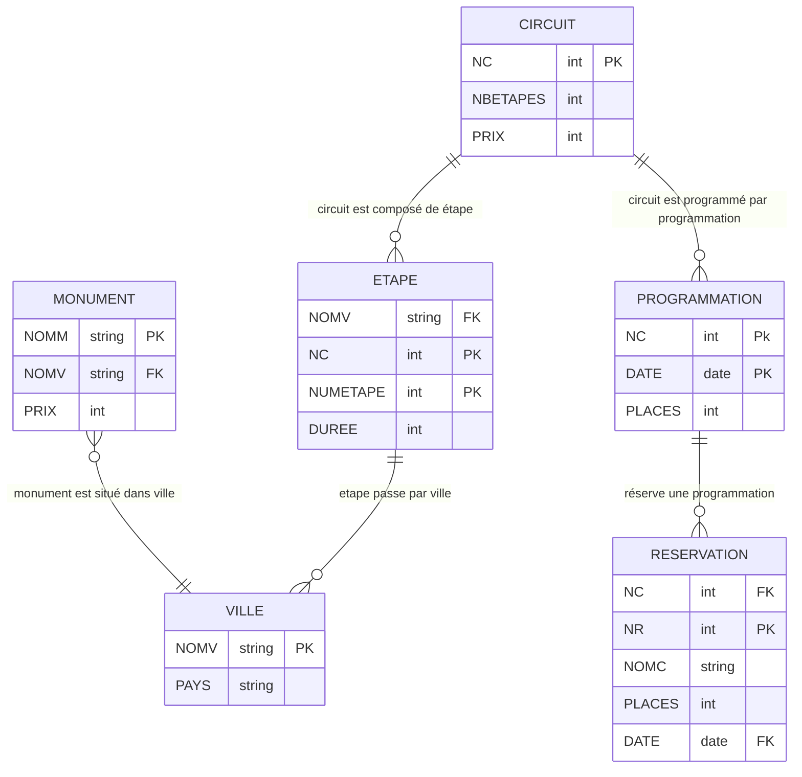

```mermaid
erDiagram

VILLE {
  NOMV string PK
  PAYS string
}

MONUMENT {
  NOMM string PK
  NOMV string FK
  PRIX int
}

CIRCUIT {
  NC int PK
  NBETAPES int
  PRIX int
}

ETAPE {
  NOMV string FK
  NC int PK
  NUMETAPE int PK
  DUREE int
}

PROGRAMMATION {
  NC int Pk
  DATE date PK
  PLACES int
}

RESERVATION {
  NC int FK
  NR int PK
  NOMC string
  PLACES int
  DATE date FK
}

MONUMENT }o--|| VILLE : "monument est situé dans ville"
ETAPE ||--o{ VILLE : "etape passe par ville"
CIRCUIT ||--o{ ETAPE : "circuit est composé de étape"
CIRCUIT ||--o{ PROGRAMMATION : "circuit est programmé par programmation"
PROGRAMMATION ||--o{ RESERVATION : "réserve une programmation"
```
