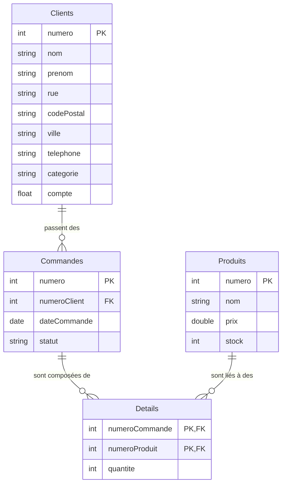

```mermaid
erDiagram

    Clients {
        int numero PK
        string nom
        string prenom
        string rue
        string codePostal
        string ville
        string telephone
        string categorie
        float compte
    }

    Commandes {
        int numero PK
        int numeroClient FK
        date dateCommande
        string statut
    }

    Produits {
        int numero PK
        string nom
        double prix
        int stock
    }

    Details {
        int numeroCommande PK, FK
        int numeroProduit PK, FK
        int quantite
    }

    Clients ||--o{ Commandes : "passent des"
    Commandes ||--o{ Details : "sont composées de"
    Produits ||--o{ Details : "sont liés à des"
```

