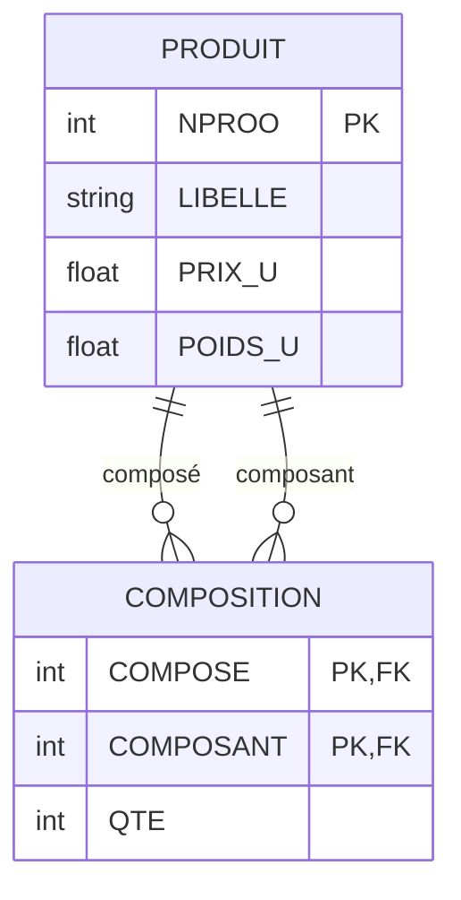

```mermaid
erDiagram

    PRODUIT {
        int NPROO PK
        string LIBELLE
        float PRIX_U
        float POIDS_U
    }

    COMPOSITION {
        int COMPOSE PK, FK
        int COMPOSANT PK, FK
        int QTE
    }

    PRODUIT ||--o{ COMPOSITION : "composé"
    PRODUIT ||--o{ COMPOSITION : "composant"

```
